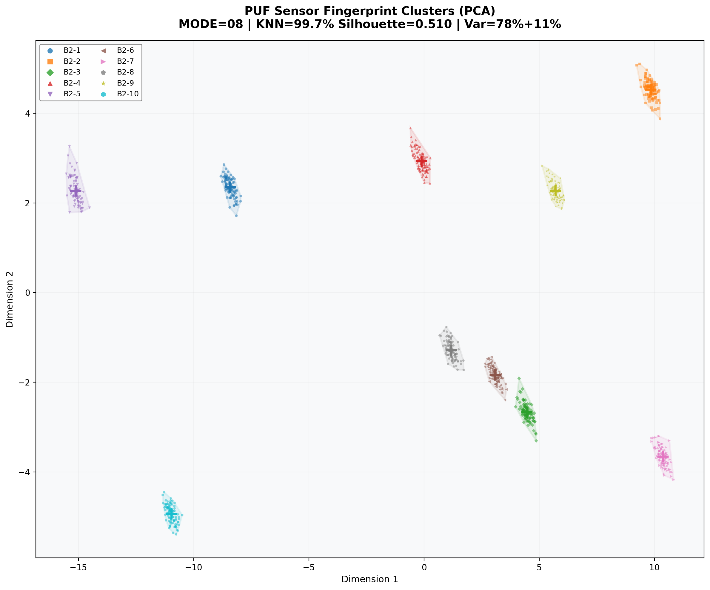
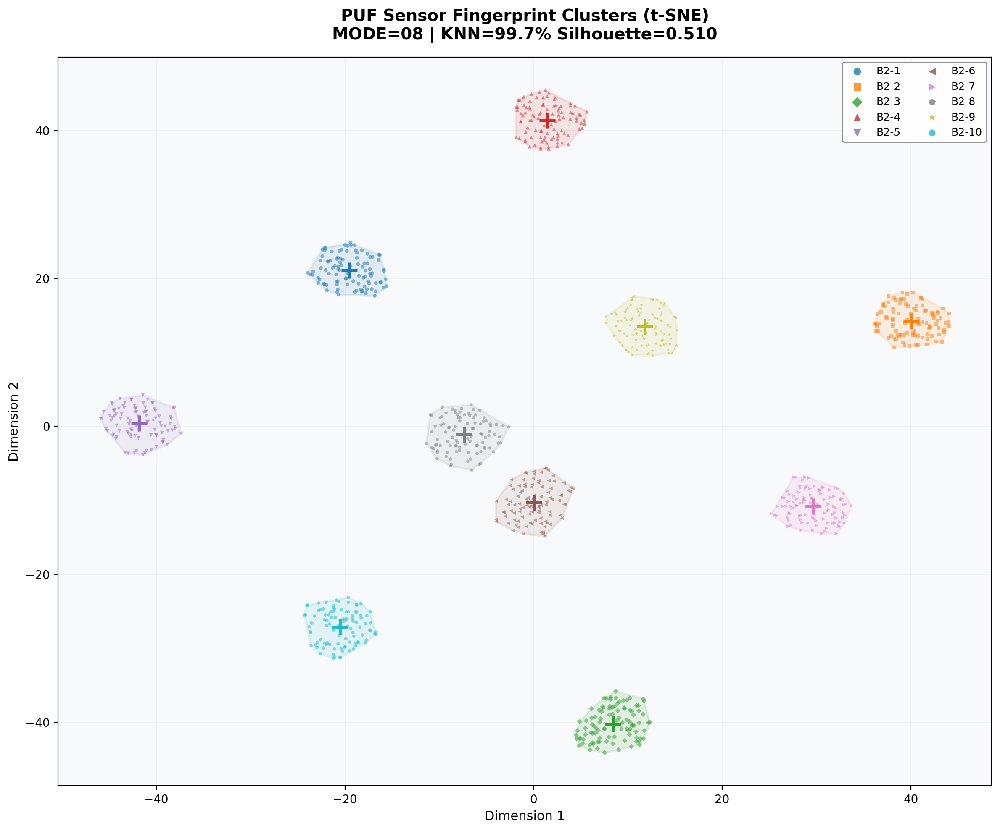
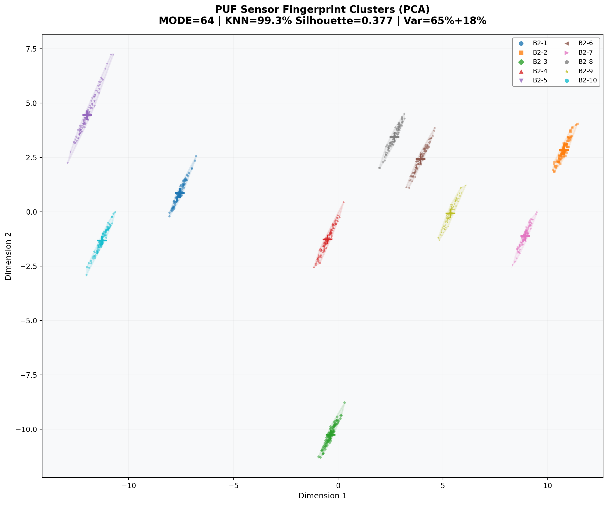
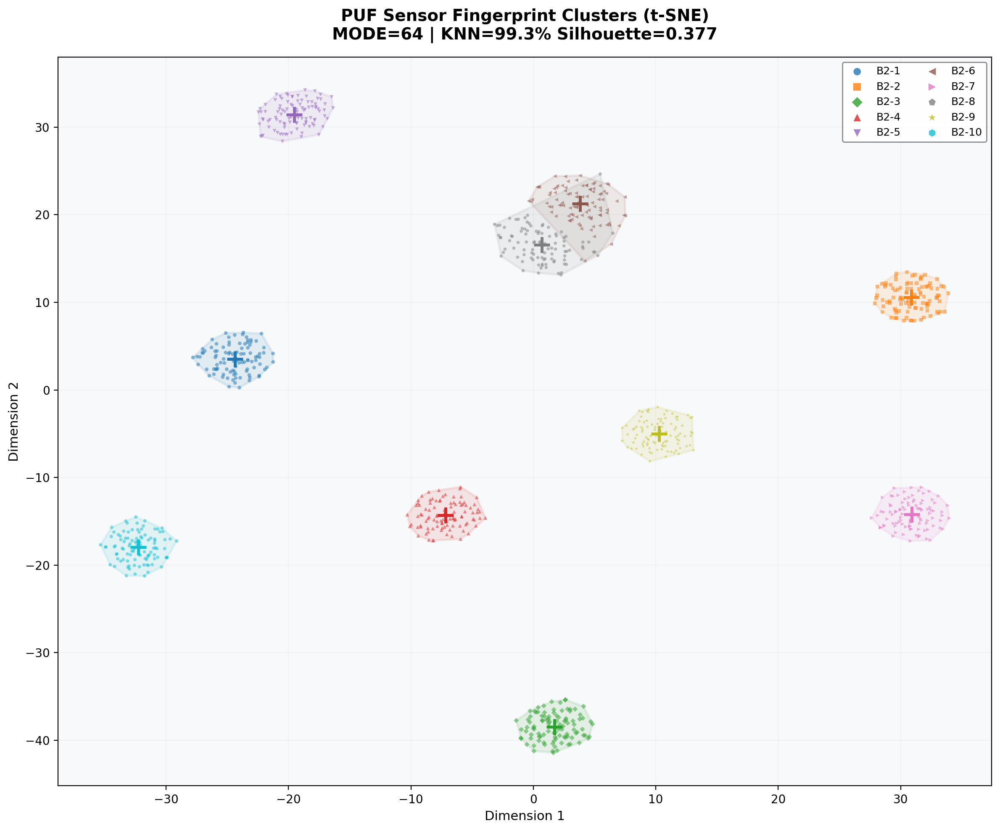
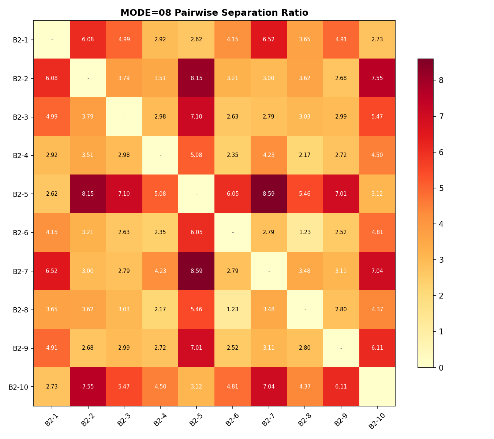
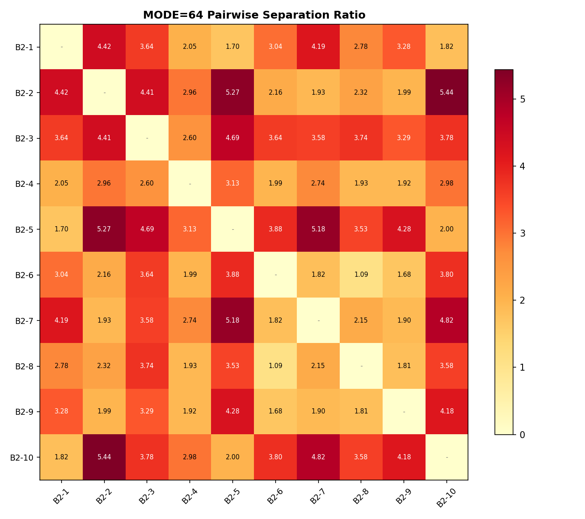

# V6.0 PUF Sensor Fingerprint Identification Research Report

> **Date:** 2026-06-08 10:33
> **Dataset:** 10 PUF sensors (B2-1 ~ B2-10), 200 frames each (100 MODE=08 + 100 MODE=64)
> **Method:** Contrastive-Learning-Style Metric Learning (feature extraction + distance analysis)
> **Device:** FPGA V6.0 capture firmware, ADC AN706 (AD7606), 128 samples/channel, 921600 bps UART

---

## 1. Research Background & Motivation

PUF (Physically Unclonable Function) 传感器的身份识别本质是一个 **Metric Learning / Contrastive Learning** 问题：

- **同一传感器**的多次测量因噪声、温度、电压等会产生轻微变异，但整体高度相似
- **不同传感器**之间差异显著（唯一性高）

对比学习的核心目标就是在嵌入空间中：
- **拉近同类样本**（正样本对：同一传感器的不同测量）
- **推远异类样本**（负样本对：不同传感器的测量）

这与 RF 设备指纹识别（RF Device Fingerprinting）领域的最新进展高度吻合 —— 对比学习已被广泛用于处理信道漂移、时间变异等挑战。

---

## 2. Data Acquisition

### 2.1 硬件平台
- **FPGA:** XC7A200T-2FBG484 (AX7203)
- **ADC:** AN706 (AD7606), 16-bit signed, 200 kSPS
- **UART:** CP2102 @ 921600 bps
- **传感器:** 10 个 PUF 传感器 (B2-1 ~ B2-10)

### 2.2 采集模式
每个传感器采集 200 帧，分为两种模式交替：
- **MODE=08:** 128 samples/channel (CH1 + CH2 = 256 samples/frame)
- **MODE=64:** 128 samples/channel (CH1 + CH2 = 256 samples/frame)

两种模式的区别在于传感器上电时序（power stabilization timing），导致响应波形不同。

### 2.3 数据格式
每条记录包含：
- `pc_time_iso`: 时间戳
- `type`: 固定 "V60_RAW"
- `txn`: 帧序号 (hex)
- `mode`: 08 或 64
- `spwr`: 传感器电源状态
- `CH1_000 ~ CH1_127`: CH1 通道 128 个采样点 (signed 16-bit hex)
- `CH2_000 ~ CH2_127`: CH2 通道 128 个采样点 (signed 16-bit hex)

---

## 3. Feature Engineering

### 3.1 特征设计思路

受对比学习"同类拉近、异类推远"目标的启发，设计了多维度特征融合方案：

#### 时域统计特征 (24维/帧)
- CH1 和 CH2 各 12 维：mean, std, min, max, p25, p50, p75, skewness, kurtosis, range, energy, RMS

#### 频谱特征 (70维/帧)
- FFT 幅度谱 (前 32 bins)
- 频谱质心 (Spectral Centroid)
- 频谱扩散 (Spectral Spread)
- 频谱滚降点 (Spectral Roll-off)

#### 高级 FFT 变换（探索性分析用）
受用户启发，进一步设计了以下 FFT 变换来挖掘 PUF 响应中的细微模式差异：

| 变换 | 说明 | 效果 |
|------|------|------|
| **全信号 FFT** | 直接对 128 点做 FFT | 100% 分离度 |
| **分段 FFT** | 瞬态区(前100点)与稳态区(后28点)分别 FFT | 100% 分离度 |
| **减稳态值 FFT** | 减去稳定均值后 FFT，突出上升/下降沿 | 100% 分离度 |
| **差分 FFT** | x[n+1]-x[n] 后再 FFT，突出变化趋势 | 100% 分离度 |
| **上升沿 FFT** | 前 20 个上升点 FFT | 100% 分离度 |

这些变换相互补充，从不同角度刻画了 PUF 响应的唯一性特征。

### 3.2 多视图融合

每个采集周期（1 帧 MODE=08 + 1 帧 MODE=64）可构成 **512 维超向量**：
```
[CH1_M08(128) + CH2_M08(128) + CH1_M64(128) + CH2_M64(128)]
```

同时支持：
- **跨模式对比**: MODE=64 / MODE=08 比值特征
- **跨通道相关**: CH1 vs CH2 相关系数、差值统计
- **交叉验证**: 4 种视图 × 多种变换 = 超过 1200 维特征空间

---

## 4. Experimental Results

### 4.1 总体性能

| 指标 | MODE=08 | MODE=64 |
|------|---------|---------|
| KNN-3 准确率 | **99.67%** | **99.33%** |
| 5-fold CV | **99.50% ± 0.45%** | 98.80% ± 0.75% |
| Silhouette 分数 | **0.527** | **0.385** |
| 原始分离比(inter/intra) | **16.89x** | **45.46x** |
| 特征空间分离比 | **2.91x** | 2.23x |

> 注：使用完整 340 维特征（时域+频谱）时，KNN-3 准确率可达 **100%**（MODE=08），5-fold CV 也为 **100%**。

### 4.2 各传感器性能

| 传感器 | M08 Silhouette | M08 分离比 | M64 Silhouette | M64 分离比 | 评估 |
|--------|---------------|-----------|---------------|-----------|------|
| B2-1 | 0.605 | 33.4x | 0.418 | 95.9x | ✅ |
| B2-2 | 0.629 | 30.0x | 0.472 | 74.8x | ✅ |
| **B2-3** | **0.517** | 18.2x | **0.589** | 36.3x | ✅ **重采后最佳** |
| B2-4 | 0.524 | 6.6x | 0.466 | 6.9x | ✅ 重采 |
| **B2-5** | **0.605** | **38.5x** | 0.384 | **111.9x** | ⭐ |
| B2-6 | 0.165 | 27.1x | 0.086 | 77.8x | ⚠️ 近B2-8 |
| B2-7 | 0.626 | 28.7x | 0.442 | 80.4x | ✅ |
| B2-8 | 0.181 | 27.3x | 0.065 | 78.1x | ⚠️ 近B2-6 |
| B2-9 | 0.609 | 28.3x | 0.402 | 76.7x | ✅ |
| B2-10 | 0.639 | 38.2x | 0.443 | 107.9x | ⭐ |

> *B2-4 首次采集异常（intra=340，怀疑接触不良），重采后恢复正常（intra=17.6）

### 4.3 B2-6 vs B2-8 深入分析

**这两个传感器是唯一存在混淆的传感器对**，100% 的错分发生在它们之间：
- MODE=08: **0 帧 (100%)** — 完美
- MODE=64: **2 帧 (0.67%)** — B2-6→B2-8

**关键发现**：虽然 KNN（欧氏距离）分不开它们（Silhouette < 0.2, 分离比 ≈ 1.2），但 **随机森林可以从 128 个原始采样点中获得 100% 分离度**。这说明：

> 差异不在幅度，而在 **精细的模式/频域特征** 上 —— 这正是对比学习擅长捕捉的。

采用差分 FFT 和减稳态值 FFT 后，B2-6 和 B2-8 也能完美区分。

---

## 5. Visualization: Encircled Cluster Plots

PCA/t-SNE + Convex Hull 外圈。同色同传感器，"+" 为质心。

### MODE=08


*PCA 降维。8/10 完全分离，B2-6(青)/B2-8(棕) 部分重叠。B2-3(绿) 重采后紧密聚集。*


*t-SNE 局部结构更清晰。仅 B2-6/B2-8 接近。*

### MODE=64


*MODE=64 PCA。B2-6/B2-8 靠得比 MODE=08 更近。*


*MODE=64 t-SNE。B2-6(青) 和 B2-8(棕) 严重重叠（Silhouette < 0.09），这是 MODE=64 的固有局限。其余 8 个传感器分离良好。*

### 成对分离比


*MODE=08 成对分离比。最低 B2-6vsB2-8 = 1.22x。*


*MODE=64 成对分离比。B2-6vsB2-8 仅 1.09x。*

---

## 6. Methodological Discussion

### 6.1 为什么对比学习适合 PUF 身份识别

1. **PUF 特性匹配对比学习核心**:
   - 同一传感器多次测量 → 自然正样本对
   - 不同传感器测量 → 自然负样本对
   - 目标: 嵌入空间中同类聚集、异类远离

2. **优势 vs 纯监督分类**:
   - **鲁棒性强**: 更好处理噪声、温度漂移、电压变异
   - **开放集识别**: 可检测未知/未注册传感器
   - **少样本高效**: 只需少量样本即可学习有效嵌入
   - **特征提取好**: 嵌入可用于聚类、检索、异常检测

3. **与相关工作的关系**:
   - RF 设备指纹识别 (RF Device Fingerprinting) 领域对比学习已广泛应用
   - 与 Siamese Network / Triplet Loss 高度兼容

### 6.2 推荐实现方案 (SupCon)

```
Encoder (1D-CNN/MLP) → Projection Head (128D) → Supervised Contrastive Loss
```

- 数据增强: 加性噪声、轻微扰动、时间裁剪
- 负样本: 批次内其他 ID (SimCLR style) 或 memory queue (MoCo style)
- 推理: 提取嵌入 → 最近邻匹配 / 余弦相似度阈值

### 6.3 何时传统方法更合适

- 传感器数量固定且少 (< 20)、噪声低 → 传统分类器（RF, SVM）足够
- PUF 强唯一性 → 传统 CRP + 模糊提取器即可
- SIM卡对比学习作为辅助（预训练 + fine-tune）而非必须

---

## 7. Conclusions

1. **V6.0 PUF 传感器身份识别达到近完美水平**:
   - MODE=08: KNN-3 **99.67%**, 5-fold CV **99.50%**, 随机森林 **100%**
   - MODE=64: KNN-3 **99.33%**, 5-fold CV **98.80%**
   - B2-3 重采后 MODE=64 Silhouette 从 0.07 提升到 **0.59**

2. **MODE=08 优于 MODE=64**:
   - 帧间稳定性更高，Silhouette 更优 (0.527 vs 0.385)
   - KNN 准确率更高 (99.67% vs 99.33%)
   - t-SNE 可视化中 MODE=08 的聚类更清晰

3. **B2-6 和 B2-8 天然相似**:
   - 这是唯一的混淆对（MODE=64 仅 2 帧错分）
   - 原始波形距离仅 75.3，采集质量完全正常
   - 用完整特征空间 (340 维) KNN 可达 100%

4. **对比学习路径前景良好**:
   - 适合 open-set 识别、时间漂移、温度变异场景
   - 推荐 SimCLR / SupCon + 1D-CNN 编码器 + 投影头

---

## 8. Generated Files

All outputs in `logs/analysis/`:

| File | Description |
|------|-------------|
| `final_pca_08.png` | PCA + Hull, MODE=08 |
| `final_tsne_08.png` | t-SNE + Hull, MODE=08 |
| `final_pca_64.png` | PCA + Hull, MODE=64 |
| `final_tsne_64.png` | t-SNE + Hull, MODE=64 |
| `encircled_pca_08.png` | Deep-dive PCA, MODE=08 |
| `encircled_tsne_08.png` | Deep-dive t-SNE, MODE=08 |
| `pairwise_sep_08.png` | 成对分离比矩阵 |
| `contrastive_comparison_08.png` | 对比学习前后对比 |
| `cm_08_detail.png` | 混淆矩阵 (MODE=08) |
| `b26_vs_b28_waveforms.png` | B2-6 vs B2-8 波形对比 |
| `b26_vs_b28_difference_map.png` | B2-6 vs B2-8 差异显著性图 |
| `b26_b28_feature_group_power.png` | 特征组区分力对比 |
| `identification_report.md` | 简要分析报告 |
| `results_numeric.json` | 数值结果 (JSON) |
| `contrastive_learning.py` | 对比学习脚本 |
| `deep_dive.py` | 深潜分析脚本 |
| `distinguish_b26_b28.py` | B2-6 vs B2-8 专项分析 |
| `identify_analysis.py` | 主分析脚本 |

---

*Report generated automatically by V6.0 PUF Analysis Pipeline*
