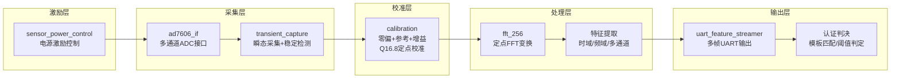

# 专利大纲：基于受控上下电瞬态响应的传感器身份提取

## 拟定名称

一种基于受控上下电瞬态响应的传感器物理身份提取方法、装置及系统

## 建议定位

主申请。该方向覆盖本项目最核心的物理入口：利用传感器在受控上电或下电过程中的瞬态响应，提取由制造差异、寄生参数、封装差异和材料差异共同决定的唯一身份特征。

## 要解决的技术问题

传统传感器认证多依赖序列号、标定表、外部标签或静态参数，容易被复制、替换或伪造。需要一种不依赖额外安全芯片、能够从传感器自身物理响应中提取身份信息的方法。

本方案解决的问题是：如何在可重复的电源激励条件下，从传感器瞬态响应中稳定提取可区分的物理身份特征，并用于注册、识别或认证。

## 核心发明点

1. 以受控上电、下电或上下电组合过程作为传感器身份激励。
2. 在固定时间窗内同步采集多通道瞬态响应，包括原始时域数据和频域幅度谱。
3. 从时域、频域、稳定点、峰值位置、段能量、通道差分或比值中生成身份特征。
4. 注册阶段生成传感器模板，验证阶段将实时响应与模板进行匹配。
5. 可结合温度、压力、时间漂移数据，对模板或判决阈值进行稳定性约束。

## 技术方案流程

### 注册阶段

1. 控制传感器从断电状态进入上电状态，或从工作状态进入下电状态。
2. 由 ADC 对至少一个通道的瞬态响应进行定长采样。
3. 对采样数据进行频谱变换，得到频域幅度谱。
4. 提取以下至少一种特征：上升/下降时间、稳定点、分段能量、频谱峰值、频段最大值、通道差分、通道比值、ON/OFF 相对特征。
5. 对多次采集的特征进行稳定性评估，筛选类内波动小、类间差异大的特征。
6. 生成传感器身份模板并存储。

### 验证阶段

1. 对待验证传感器施加与注册阶段一致或预定的电源激励。
2. 采集瞬态响应并提取同类特征。
3. 与注册模板计算距离、相似度或分类结果。
4. 当匹配结果满足阈值时确认身份，否则拒绝或触发重采样。

## 系统组成

- **电源激励控制模块**：控制传感器上电、下电、放电等待和采集触发时序，支持POWER_OFF→POWER_ON→HOLD_ON→IDLE四态循环。
- **ADC 采集模块**：同步采集至少两个通道的瞬态响应，支持参数化时序优化（IDLE/CONV/POST_CONV/RD可配）。
- **校准模块**：对每个通道独立进行零偏-参考点-增益三级校准，Q16.8定点增益系数，输出校准后的电压值。
- **稳定检测模块**：在采集过程中实时检测双通道信号稳定性（滑动窗口：连续16采样点波动≤±20 LSB），输出稳定点索引作为质量指标。
- **FPGA 预处理模块**：缓存原始数据、执行定点FFT变换（支持扩展为SCALE_SCH挑战扫描）、峰值检测。
- **数据输出模块**：通过 UART 输出 STATUS/STABLE/RAW/SPECTRUM/PEAKS/DEBUG/STATE_LOG 七类帧，支持ASCII/二进制双模式自适应切换。
- **质量门控模块**：对采集数据进行完整性校验（256挑战×4线型全矩阵检查），异常样本拒绝入库或触发重采样。
- **特征提取与认证模块**：在 FPGA、MCU 或 PC 端完成特征计算、模板注册和身份判决。

## 独立权利要求骨架

### 方法权利要求

一种传感器身份提取方法，包括：

1. 对待注册或待验证传感器施加受控电源状态切换，使传感器产生瞬态响应；
2. 在所述电源状态切换后的预定采样窗口内采集所述瞬态响应；
3. 对所述瞬态响应提取至少一种时域特征和/或频域特征；
4. 基于所述特征生成传感器身份模板或待验证身份响应；
5. 根据所述身份模板与待验证身份响应的匹配结果确定传感器身份。

### 装置/系统权利要求

一种传感器身份认证系统，包括电源控制单元、模数转换单元、数据缓存单元、频谱变换单元、特征提取单元和认证判决单元；其中电源控制单元用于产生受控上电或下电激励，频谱变换单元用于从瞬态响应生成频域特征，认证判决单元用于根据注册模板和实时响应确认身份。

### 存储介质或程序产品权利要求

一种计算机可读存储介质或计算机程序产品，其存储的指令在被处理器执行时，实现上述传感器身份提取或认证方法。

## 从属权利要求方向

### 电源激励相关
- 电源状态切换包括上电、下电、重复上下电循环或预充电后放电。
- 电源激励由POWER_OFF→POWER_ON→HOLD_ON→IDLE四态时序控制，其中POWER_OFF阶段保持预定放电时间。
- 上电响应采集和下电响应采集在同一自动循环周期内连续执行，确保时间一致性。

### 采样与质量门控相关
- 采样窗口根据稳定点、阈值穿越点、能量变化率或固定延时确定。
- 所述稳定点通过双通道滑动窗口检测确定：对各通道采样序列，当连续预定数量（如16）的采样点均落在当前窗口参考值的预定容差范围（如±20 LSB）内时，判定该通道稳定；双通道均稳定时记录稳定点索引（参见专利06）。
- 采集阶段包含完整性校验：检查采集数据是否包含完整的挑战码×线型×频域bin的全矩阵记录，不完整时触发重采集。
- 注册阶段对多次采集进行稳定性筛选，剔除与同批模板距离超过阈值的异常样本。
- 采集质量门控还包括检查稳定点是否在预定范围内，超出范围时标记为异常。

### 特征相关
- 频域特征包括定点FFT幅度谱、频段最大值、峰位、峰间距、段能量或谱形矩。
- 频域特征支持通过频谱变换配置参数（如SCALE_SCH）作为数字观测挑战，获取多视角频域响应。
- 多通道特征包括通道差分、通道比值、通道间相关系数或相位/能量偏移。
- CH1-CH2差分特征用于抑制共模电源噪声和采集链漂移（ON信号区分度从单通道55%提升至差分99%）。
- 上电响应和下电响应共同参与身份判决，具体包括：联合特征向量拼接、ON/OFF比值特征、ON/OFF分别匹配后的一致性校验。

### 认证判决相关
- 认证阶段结合环境条件或漂移模型动态调整匹配阈值。
- 当环境条件（温度/压力）超出注册条件范围时，触发对模板的漂移补偿或自适应阈值调整。
- 认证失败时触发重采样，重采样次数超过阈值时拒绝认证。

### 安全与通信相关
- 认证响应通过二进制帧协议传输，包含Magic字节（0xA5 0x5A）、事务ID和结构化帧头，支持损坏帧自动丢弃和同步恢复。
- 数据输出单元支持ASCII可读模式和二进制紧凑模式的自适应切换。

### 校准相关
- 在身份采集前，对每个ADC通道执行零偏校准和参考电压校准，生成Q16.8定点增益系数。
- 所述校准与身份采集共享同一采集链，校准参数用于将原始ADC码值转换为归一化电压。

## 可用实验支撑

- 当前已有 10 个传感器、每个 50 次采集的基线数据。
- 已有 B2-1 高温、高压漂移数据。
- 已有 ON/OFF 频谱、`SCALE_SCH` 扫描、Seg-Max、LDA、峰位图谱等分析。
- 当前报告显示 OFF `sch=0` 的 Seg-Max 4 维特征可达到较高区分度。

## 需要补的实验

- 注册集/验证集分离后的误识率和拒真率。
- 温度、压力、时间漂移下的稳定性。
- 上电特征、下电特征、ON/OFF 联合特征的对比。
- 多通道特征相对单通道特征的提升。
- 采集次数、模板大小和认证耗时。

## 附图建议

1. 系统框图：电源控制、传感器、ADC、FPGA、PC/认证模块。
2. 流程图：注册阶段和验证阶段。
3. 波形图：上电/下电瞬态响应和采样窗口。
4. 特征空间图：不同传感器聚类结果。

## 风险与规避

- 现有 sensor-based PUF 已存在，需要强调本方案不是利用静态校准表，而是利用受控电源瞬态响应。
- 现有 SRAM power-up PUF 已存在，需要强调对象是外部传感器及其模拟瞬态响应，而不是存储单元初值。
- 现有普通指纹分类算法较多，需要将特征提取与硬件激励、采集链和认证技术效果绑定。
- "频域特征"表述过于宽泛，易被现有频谱分析技术覆盖；建议在权利要求中用"定点FFT获取的频域幅度谱"进行限定。
- 模板匹配方式过于通用，建议在说明书和从属权利要求中具体化为"基于多域特征向量距离（如余弦相似度、欧氏距离、马氏距离）的匹配"或"基于分类器（如LDA/PCA/SVM）的身份判定"。

## 关联专利

本专利为本专利族主案，以下专利为其提供从属实施例和配套保护：
- **专利02**（全链路闭环系统）：本专利方法的具体系统实现，14状态自动循环流水线。
- **专利06**（双通道滑动窗口稳定性检测器）：本专利中"采样窗口"和"质量门控"的具体硬件实施方式。
- **专利05**（ON/OFF挑战码同步绑定）：本专利中"上下电共同参与身份判决"的具体硬件机制。
- **专利04**（SCALE_SCH挑战扫描）：本专利中"频域特征"的增强观测方法。
- **专利03**（定点FFT溢出特征放大器）：本专利中"频谱变换"的底层增强机制。
- **专利07**（定点不可复现性防逆向）：本专利系统的安全维度补充。
