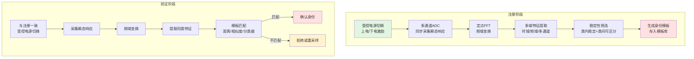
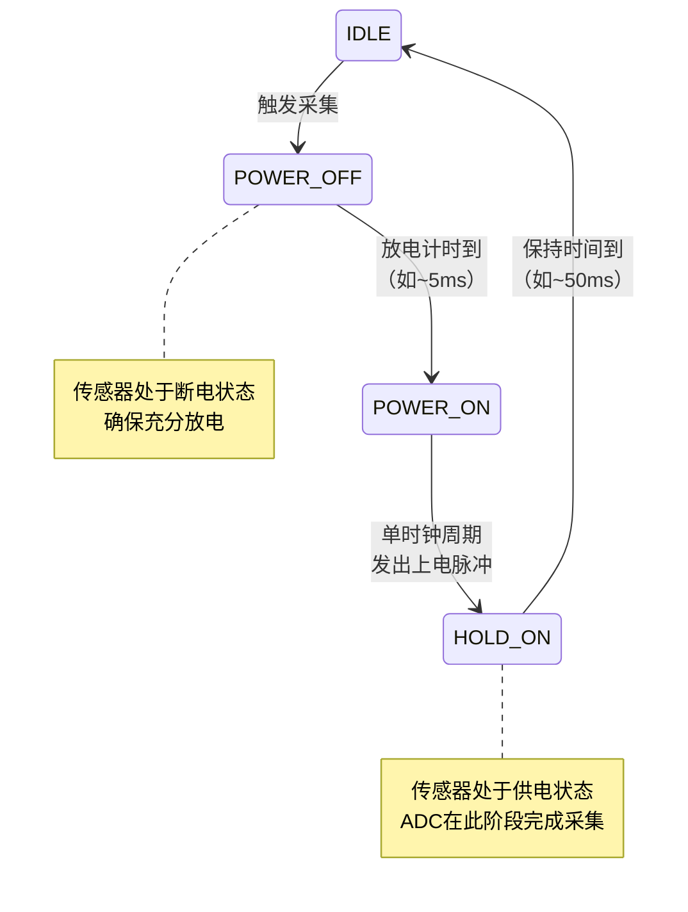
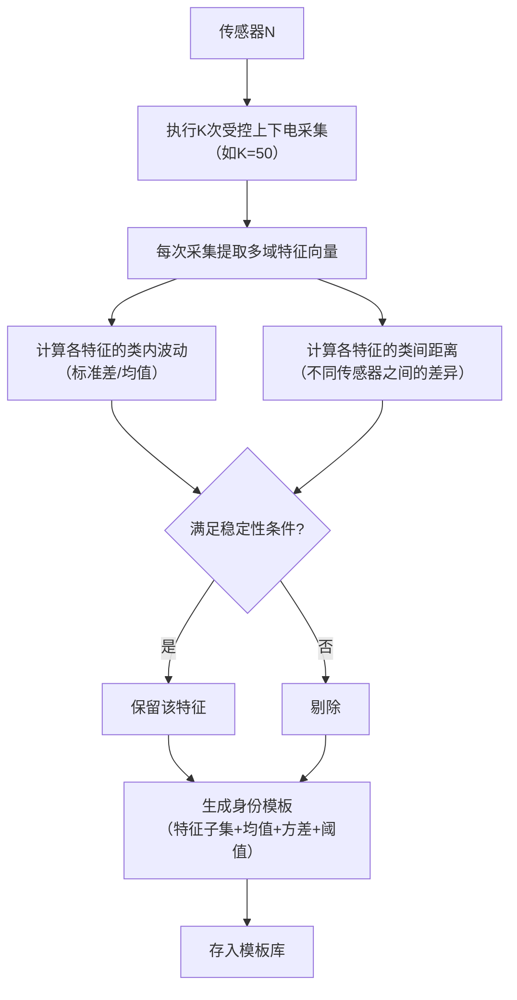
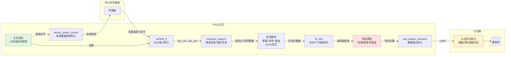
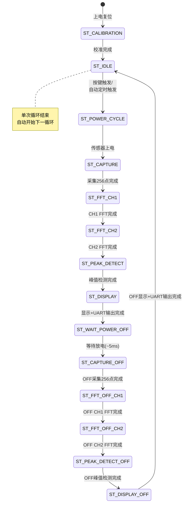

# 专利交底书

## 一种基于受控上下电瞬态响应的传感器物理身份提取方法、装置及系统

---

## 一、技术领域

本发明属于传感器身份认证与硬件安全技术领域，具体涉及一种利用传感器在受控电源状态切换过程中产生的瞬态响应信号，提取由传感器制造差异决定的唯一物理身份特征的方法、装置及系统。

---

## 二、背景技术

### 2.1 现有传感器认证方式及其缺陷

传感器广泛应用于工业控制、物联网、环境监测、医疗设备等领域。在许多应用场景中，需要确认所连接的传感器的身份——即"这个传感器是否是我信任的那一个"。

目前主流的传感器身份确认方式包括：

1. **序列号/电子标签**：在传感器出厂时写入唯一序列号，使用时通过通信协议读取。缺点是序列号可被复制、篡改，攻击者替换传感器后只需复制原序列号即可绕过认证。

2. **标定表/校准参数**：利用传感器的标定参数作为身份依据。但标定表同样是数字信息，可被复制到仿冒传感器中。

3. **外部安全芯片**：在传感器模块中嵌入专用安全芯片（如ATECC508A）。缺点是增加硬件成本、占用PCB面积、需要额外的通信接口，且安全芯片本身也可能遭受物理攻击。

4. **静态参数测量**：利用传感器的静态参数（如电阻、电容、灵敏度、零偏）作为身份特征。但这些参数容易受环境条件（温度、湿度、老化）影响，且测量精度依赖于仪表，不同仪表间的一致性难以保证。

上述方法的共同缺陷是：身份信息来源于可被复制或仿造的数字/静态信息，而非传感器自身的固有物理特性。

### 2.2 传感器物理不可克隆函数（Sensor PUF）

近年来，物理不可克隆函数（Physical Unclonable Function, PUF）在硬件安全领域受到广泛关注。PUF利用制造过程中不可避免的随机差异，提取硬件自身的唯一身份特征。

现有PUF技术主要集中在：

- **SRAM PUF**：利用SRAM上电时的随机初始值。但其身份源是存储单元，而非外部传感器。
- **Arbiter PUF**：利用门延迟差异。但需要专用电路，不适用于通用传感器身份认证。
- **Ring Oscillator PUF**：利用振荡频率差异。同样需要专用电路。

针对传感器的PUF研究仍处于起步阶段。现有 sensor-based PUF 方案多依赖传感器的静态制造偏差（如MEMS结构的电容差），但这类偏差信号微弱，容易淹没在环境噪声中，导致认证可靠性不足。

### 2.3 现有技术的不足

综上所述，现有技术存在以下不足：

1. **身份可复制**：数字序列号、标定表等可被直接复制。
2. **需要额外硬件**：安全芯片、PUF电路等增加成本和体积。
3. **认证可靠性低**：静态参数受环境漂移影响大，类内波动与类间差异的比值不理想。
4. **缺乏系统方案**：现有方案多为离散算法，缺少从激励到认证判决的完整链路。

---

## 三、发明内容

### 3.1 要解决的技术问题

本发明要解决的技术问题是：**如何在不依赖额外安全芯片的条件下，从传感器自身的物理响应中稳定提取可区分的身份特征，并用于注册、识别或认证**。

具体包括以下子问题：

1. 如何产生可重复且对制造差异敏感的物理激励响应？
2. 如何在合适的采集窗口内捕获传感器的瞬态响应信号？
3. 如何从瞬态响应中提取稳定且具有区分度的身份特征？
4. 如何将注册阶段的模板与验证阶段的实时响应进行可靠匹配？
5. 如何在温度、压力、时间漂移等环境变化下保持认证准确性？

### 3.2 技术方案概述

本发明的核心思想是：**以受控电源状态切换（上电或下电）作为传感器的物理身份激励源，在电源切换后预定采样窗口内采集传感器的瞬态响应信号，通过频域变换提取身份特征，结合多域特征融合与稳定性筛选生成身份模板，在验证阶段将实时响应与模板匹配确认传感器身份。**



### 3.3 技术方案详细描述

#### 3.3.1 受控电源激励

不同于传统的持续供电或简单开关，本发明采用受控的电源状态切换时序作为传感器的物理激励源。

**激励方式**包括：
- **上电激励**：传感器从断电状态切换到上电状态，记录上电过程中的瞬态响应。
- **下电激励**：传感器从工作状态切换到断电状态，记录下电过程中的瞬态响应。
- **上下电组合激励**：在一次认证循环中先后执行上电激励和下电激励，获取双态联合响应。

**电源控制时序**采用四态循环：



**技术要点**：
- POWER_OFF阶段的放电时间可根据不同传感器的寄生电容特性调整。
- HOLD_ON阶段持续时间需满足：采集窗口时长 + FFT处理时长 + 数据传输时长。
- 电源切换的时序精度由FPGA硬件状态机保证，重复性远优于MCU软件控制。

#### 3.3.2 多通道同步采集与稳定检测

在电源状态切换后的预定采样窗口内，通过ADC（模数转换器）对传感器的至少一个通道、优选两个独立通道的瞬态响应进行同步采集。

**采集参数**（以当前实施例为例）：
- 采样点数：256点
- 采样率：约171 kSPS（可配置，可根据瞬态持续时间自适应调整）
- 覆盖时间：约1.5 ms（可覆盖典型传感器上电瞬态）
- ADC分辨率：16-bit
- 通道数：2通道同步采集

**稳定检测机制**：

在采集过程中，同时对两个通道进行滑动窗口稳定性检测：

```mermaid
flowchart TD
    START([第N个采样点]) --> CH1{CH1在<br/>[ref1-20, ref1+20]内?}
    CH1 -- 否 --> R1[重置ref1=当前值<br/>cnt1=1]
    CH1 -- 是 --> C1{cnt1==15?}
    C1 -- 是 --> D1[ch1_stable=1]
    C1 -- 否 --> I1[cnt1++]
    D1 --> CH2
    I1 --> CH2
    R1 --> CH2

    CH2{CH2在<br/>[ref2-20, ref2+20]内?}
    CH2 -- 否 --> R2[重置ref2=当前值<br/>cnt2=1]
    CH2 -- 是 --> C2{cnt2==15?}
    C2 -- 是 --> D2[ch2_stable=1]
    C2 -- 否 --> I2[cnt2++]
    D2 --> JOINT
    I2 --> JOINT
    R2 --> JOINT

    JOINT{ch1_stable ∧ ch2_stable<br/>∧ !stable_found?}
    JOINT -- 是 --> RECORD[记录stable_point=N<br/>stable_found=1]
    JOINT -- 否 --> NEXT[继续下一采样点]
    RECORD --> NEXT
```

**技术要点**：
- 连续检测参数：需连续16个采样点（可配置）全部落入±20 LSB（可配置）的容差带。
- 双通道AND逻辑：仅当两个通道同时满足稳定条件时才记录稳定点，确保通道间数据时序对齐。
- 动态参考值重置：当采样值超出容差带时，窗口参考值立即更新为当前采样值，计数器归零，使检测器能适应非单调瞬态波形。
- 所述稳定点索引（stable_point）用作后续特征提取的采集窗口边界参考和质量控制指标。

#### 3.3.3 定点频谱变换

对采集的瞬态时域信号进行定点快速傅里叶变换（FFT），获得频域幅度谱。

**技术要点**：
- 采用FPGA内嵌的定点FFT IP核（如Xilinx FFT v9.1），位宽16-bit。
- FFT点数：256点（输出128个频域bin，对应0至采样率/2）。
- 幅度计算：通过对FFT输出的实部和虚部分别取绝对值、求平方和并右移1位，获得功率谱估计：`magnitude = (|real|² + |imag|²) / 2`。
- 定点FFT在特定缩放配置下的内部溢出行为可将传感器微小幅值差异映射为频谱中确定性的差异图样，增强身份特征的可区分性（详见关联专利03）。

#### 3.3.4 多域特征提取

从瞬态响应中提取至少一种、优选多种时域特征和/或频域特征：

**时域特征**：
- 上升/下降时间：信号从10%到90%过渡区间的持续时间
- 稳定点索引：由滑动窗口检测器输出的稳定时刻
- 过冲/下冲幅度：瞬态响应超过稳态值的峰值
- 瞬态波形面积/斜率

**频域特征**：
- FFT幅度谱的各频率bin幅值
- 频段最大值（Seg-Max）：将频谱划分为若干相邻频段，每个频段取最大值
- 频谱峰值位置（峰位）：前N个最大峰在频域中的位置
- 段能量：各频段内的积分能量
- 频谱形状矩（谱形矩）：频谱的均值、方差、偏度、峰度等统计量
- 峰间距：相邻峰值之间的频率距离

**多通道特征**：
- 通道差分（CH1-CH2）：同一传感器两个独立通道的频谱差分，用于抑制共模噪声
- 通道比值（CH1/CH2）：比值特征具有增益不变性
- 通道间相关系数：双通道信号的相关性度量

**双态联合特征**：
- ON/OFF相对特征：同一传感器上电响应与下电响应的比值、差分或拼接
- ON/OFF一致性校验：分别提取特征后，验证两者的身份一致性

**实验验证**：
- CH1-CH2差分将ON信号区分度从单通道的55%提升至99%。
- ON/OFF联合（256维）的LDA 5-fold CV准确率优于单独ON或OFF。
- Shape特征和Ratios特征在5-fold CV中达到99.60%准确率。

#### 3.3.5 身份模板注册

注册阶段对同一传感器进行多次（如50次）受控电源切换和采集，提取每次采集的多域特征向量。对多次采集的特征进行稳定性评估，筛选类内波动小、类间差异大的特征子集，生成传感器身份模板。

**注册流程**：



**稳定性筛选指标**：
- 类内方差（或变异系数 CV = σ/μ）小于阈值
- 类间距离（或Fisher Score、JS散度）大于阈值
- 跨环境条件（温度/压力/时间漂移）下的变异系数
- 剔除与同批模板距离超过阈值的异常样本（质量门控）

**模板内容**（建议）：
- 特征子集的索引（哪些特征被选用）
- 各特征在注册样本上的均值 μ_i 和标准差 σ_i
- 认证匹配所需的距离阈值 τ（根据类内距离分布确定，如 μ_intra + 3σ_intra）

#### 3.3.6 身份验证

对待验证传感器施加与注册阶段一致的受控电源激励，采集瞬态响应并提取相同的多域特征。将实时特征与注册模板进行匹配计算，根据匹配结果确认或拒绝传感器身份。

**匹配方式**（可选一种或多种组合）：
- **距离度量**：余弦相似度、欧氏距离、马氏距离等
- **分类器**：LDA（线性判别分析）、PCA+SVM、KNN等
- **概率模型**：基于注册样本分布计算待验证样本属于该传感器的后验概率

**自适应阈值**：
- 根据采集时的辅助特征（如OFF信号能量、频谱重心）推断当前环境状态（温度/压力等）
- 当环境条件超出注册条件范围时，对匹配阈值进行自适应调整或漂移补偿
- 当匹配结果在阈值边界附近时，触发重采样防止误判

**多因子联合判决**：
- ON特征和OFF特征分别匹配后，综合两者的匹配分数
- 当ON和OFF的匹配结果一致时，降低阈值要求（一致性增强）
- 当ON和OFF的匹配结果不一致时，触发重采样或拒绝（不一致告警）

### 3.4 有益效果

与现有技术相比，本发明具有以下有益效果：

1. **无需额外安全芯片**：利用传感器自身的物理瞬态响应作为身份特征源，不增加硬件成本。适用于已在系统中存在的ADC+FPGA/MCU架构。

2. **身份不可复制**：瞬态响应由传感器的制造差异（寄生参数、封装差异、材料差异）决定，无法通过软件或数字信息复制。攻击者即使获得完整的算法描述和注册模板，更换不同传感器后产生的瞬态响应天然不同。

3. **双通道差分抗共模噪声**：通过CH1-CH2差分处理，有效抑制电源噪声、温度漂移等共模干扰，ON信号区分度从55%提升至99%。

4. **上下电双态联合认证增强可靠性**：单一状态（仅ON或仅OFF）可能对环境变化敏感，双态联合认证利用ON/OFF相对关系提供了额外的环境鲁棒性。

5. **质量门控保障采集一致性**：注册和验证阶段均通过稳定点检测和完整性校验对采集质量进行评估，剔除异常样本，提升模板质量和认证准确率。

6. **全链路闭环自动化**：整个流程（电源控制→采集→频谱变换→特征提取→输出）在FPGA单一状态机中自动完成，无需人工干预，时序精度高，重复性好。

---

## 四、附图说明

### 附图1：系统整体架构图



### 附图2：主状态机全闭环流程



### 附图3：注册阶段流程图

（见3.3.5节mermaid流程图）

### 附图4：验证阶段流程图

（见3.2节mermaid流程图）

### 附图5：双通道稳定检测波形示意图

```
CH1采样值
  ↑
  │   ╱╲
  │  ╱  ╲___稳定区___
  │ ╱             ───
  │╱
  └──────────────────────→ 采样点
                           ↑
                      stable_point

CH2采样值
  ↑
  │    ╱╲
  │   ╱  ╲__稳定区____
  │  ╱              ───
  │ ╱
  └──────────────────────→ 采样点
                           ↑
                      stable_point

稳定判定: CH1稳定 ∧ CH2稳定 → 记录stable_point
```

---

## 五、具体实施方式

### 5.1 硬件实施例

以下结合附图和具体实施例对本发明进行详细说明。需要说明的是，以下实施例仅用于解释本发明，不构成对本发明保护范围的限定。

**实施例1：基于FPGA+AD7606的压力传感器身份认证系统**

系统硬件组成：
- FPGA芯片：Xilinx Artix-7系列（如XC7A35T），工作时钟200MHz
- ADC芯片：AD7606，8通道、16-bit、双极性输入
- 传感器：模拟输出压力传感器（如MPX系列）
- 电源控制：传感器供电由FPGA I/O通过PMOS管控制
- 通信接口：UART（波特率921600），通过CP2102 USB-UART桥接至PC

**电源控制电路**：
- FPGA I/O（3.3V）→ 电平转换 → PMOS栅极
- PMOS源极接VCC（如5V），漏极接传感器供电引脚
- FPGA输出低电平时PMOS导通，传感器上电
- FPGA输出高电平时PMOS截止，传感器断电
- 传感器供电引脚并联适当电容（如10μF）模拟实际工作负载

**ADC接口**：
- AD7606配置为并行接口模式
- CS/RD信号由FPGA控制
- BUSY信号作为转换完成指示
- 时序参数可配置：IDLE_CYCLES=0, CONV_LOW_CYCLES=1, RD_LOW_CYCLES=1（优化配置）
- 有效采样率达约171 kSPS

### 5.2 FPGA内部模块实施

**主状态机**（`transient_puf_test_top`模块）：
14状态的完整闭环，参见附图2。各状态设有3秒超时看门狗，超时后自动复位并记录错误码。

**电源控制模块**（`sensor_power_control`模块）：
- 四态循环：IDLE → POWER_OFF → POWER_ON → HOLD_ON → IDLE
- 可配置参数：POWER_OFF放电周期数、HOLD_ON保持周期数
- 输出：传感器电源控制信号、上电脉冲、下电脉冲、调试事件码

**瞬态采集模块**（`transient_capture`模块）：
- 固定长度采集：256点双通道同步采集
- 内嵌滑动窗口稳定性检测：16样本±20 LSB
- 输出：采集完成标志、双通道采样数据、稳定点索引

**FFT变换模块**（`fft_256`模块）：
- 例化Xilinx FFT v9.1 IP核
- 256点Pipelined Streaming I/O模式
- SCALE_SCH可配置（0-255），用于调节各stage缩放策略
- 输出128点频域幅度谱

**校准模块**：
- 对每个ADC通道独立执行两点校准（0V零偏 + 2.5V参考电压）
- Q16.8定点格式存储校准增益系数
- 校准公式：`calibrated_voltage = (raw_adc - zero_offset) × gain_q / 65536`

### 5.3 PC端特征提取与认证实施

**特征提取流程**：
1. 从UART接收完整的一帧采集数据（256采样点 × 2通道 × 时域/频域）
2. 解析数据帧结构：STATUS → STABLE → RAW → SPECTRUM → PEAKS
3. 提取特征向量（推荐组合：Seg-Max + shape + ratios + moments）
4. 归一化处理

**注册流程**：
1. 对目标传感器执行N次（如N=50）独立采集
2. 每次采集提取M维特征向量（如M=256）
3. 计算各特征的类内均值μ_i和标准差σ_i
4. 计算各特征的Fisher Score（类间方差/类内方差）
5. 选择Fisher Score最高的K维特征（如K=32）
6. 存储：特征索引向量 + μ_i + σ_i + 认证距离阈值τ

**验证流程**：
1. 对待验证传感器执行1次采集
2. 提取注册阶段选定K维特征
3. 计算与注册模板的马氏距离：`d = sqrt(Σ (x_i - μ_i)² / σ_i²)`
4. 如 `d < τ` → 确认身份；否则 → 拒绝或触发重采样

### 5.4 环境漂移处理

- 当环境条件（温度/压力）超出注册条件范围时，可对模板进行漂移补偿。
- 一种补偿方式：利用OFF信号的频谱重心作为环境指示器，建立"环境参数—匹配距离漂移量"的回归模型。
- 另一种补偿方式：在多个环境条件下注册多组模板，认证时根据环境指示器选择最近的模板。

---

## 六、权利要求书（骨架）

### 独立权利要求1（方法）

一种传感器身份提取方法，包括：

1. 对待注册或待验证传感器施加受控电源状态切换，使传感器产生瞬态响应；
2. 在所述电源状态切换后的预定采样窗口内，通过模数转换器采集所述瞬态响应；
3. 对所述瞬态响应进行定点频谱变换，获取频域响应；
4. 从所述瞬态响应提取至少一种时域特征和/或从所述频域响应提取至少一种频域特征；
5. 基于所述特征生成传感器身份模板或待验证身份响应；
6. 根据所述身份模板与待验证身份响应的匹配结果确定传感器身份。

### 独立权利要求2（系统）

一种传感器身份认证系统，包括：

1. 电源控制单元，用于对传感器施加受控上电或下电激励，使传感器产生瞬态响应；
2. 模数转换单元，用于在所述电源激励后的预定采样窗口内采集所述瞬态响应；
3. 数据缓存单元，用于存储采集的瞬态响应数据；
4. 频谱变换单元，用于对所述瞬态响应数据进行定点频谱变换，生成频域响应；
5. 特征提取单元，用于从所述瞬态响应和/或频域响应中提取身份特征；
6. 认证判决单元，用于根据注册阶段生成的身份模板与验证阶段的实时响应特征进行匹配，确认传感器身份。

### 独立权利要求3（存储介质）

一种计算机可读存储介质，其存储的指令在被处理器执行时，实现上述传感器身份提取或认证方法。

### 从属权利要求方向

（详见专利大纲"从属权利要求方向"章节，此处不重复展开）

### 从属权利要求摘要

**电源激励类**：上电/下电/上下电组合；四态时序控制；上电下电在同一循环内连续执行。

**采样与质量门控类**：双通道滑动窗口稳定检测；采集完整性校验；异常样本自动剔除与重采样。

**特征类**：频段最大值/峰位/峰间距/段能量/谱形矩；多通道差分/比值/相关性；ON/OFF联合特征拼接/比值/一致性校验。

**校准类**：零偏-参考-增益Q16.8定点三级校准。

**认证类**：自适应阈值/漂移补偿；多因子联合判决；重采样次数限制。

**安全类**：二进制帧协议Magic字节+事务ID+帧校验。

---

## 七、技术效果对比

| 对比维度 | 现有技术（序列号/安全芯片） | 现有技术（SRAM PUF） | 本发明 |
|:---|:---|:---|:---|
| 身份源 | 数字信息（可复制） | SRAM上电初值（芯片内部） | 传感器瞬态响应（外部传感器） |
| 额外硬件 | 需安全芯片 | 需专用PUF电路 | 无需（复用已有ADC+FPGA） |
| 通道数 | — | — | 双通道同步采集+差分 |
| 双态认证 | 不支持 | 仅上电 | ON/OFF双态联合 |
| 环境鲁棒性 | 依赖芯片 | 较好 | 多因素联合+自适应阈值 |
| 抗克隆性 | 弱 | 强 | 强（物理不可克隆） |
| 实验区分度 | — | — | OFF 99.8%, ON差分99.0%, shape 99.6% |

---

## 八、发明人与申请人信息

（待填写）

## 九、相关专利引用

本发明为本专利族主案，以下相关专利为本发明的具体实施提供支撑：
- **专利02**（传感器身份认证全链路闭环系统）：本发明的系统硬件实现，14状态自动循环流水线。
- **专利03**（定点FFT溢出特征放大器）：本发明中频谱变换的底层特征增强机制。
- **专利04**（SCALE_SCH挑战扫描响应图谱生成）：本发明中频域特征的多视角增强方法。
- **专利05**（ON/OFF挑战码同步绑定）：本发明中双态联合认证的硬件同步机制。
- **专利06**（双通道滑动窗口稳定性检测）：本发明中采集质量门控的硬件实施方式。
- **专利07**（定点不可复现性防逆向）：本发明的安全维度补充。
