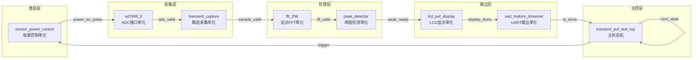
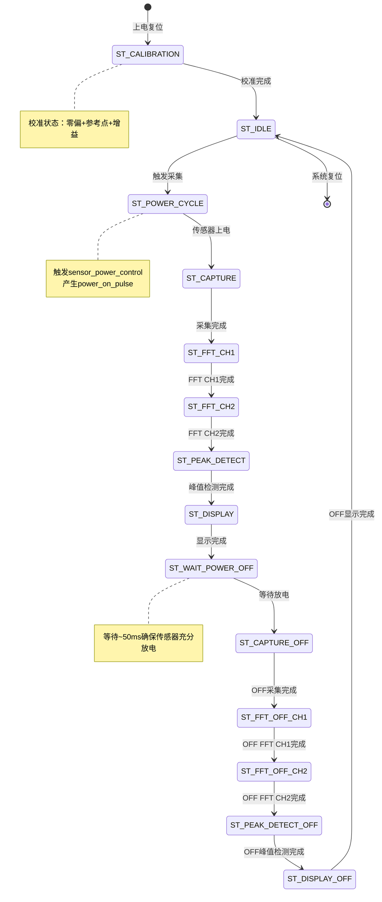

# 专利大纲：传感器身份认证全链路闭环系统

## 拟定名称

一种传感器物理身份认证全链路自动闭环系统

## 建议定位

**独立申请（装置/系统权利要求）**。三件已有专利（01-03）均聚焦"方法"层面（怎么做身份提取），缺少对"系统/装置"层面（用什么自动完成）的保护。本专利填补这一空白，覆盖从电源激励到认证判决的完整硬件链路。

## 要解决的技术问题

现有传感器身份认证方案多为离散的软件算法或分散的硬件模块，缺乏将"激励-采集-处理-显示-传输-认证"整合为全自动流水线的系统级方案。人工干预环节多、时序一致性难以保障、上下电双态采集容易错位。

本方案解决的问题是：如何构建一个无需人工干预的、时序严格可控的、上下电双态自动循环的传感器身份认证全链路系统。

## 核心发明点

1. **全自动循环流水线**：电源激励、ADC采集、FPGA预处理（FFT/峰值检测）、本地LCD显示、UART数据输出在单一状态机中自动循环，无需外部触发即可周期性完成身份采集。
2. **上下电双态时序绑定**：上电采集→处理→输出完成后，自动转入下电采集→处理→输出，确保ON/OFF双态在同一个循环周期内完成，时间一致性由硬件状态机保证。
3. **多级超时看门狗保护**：每个操作状态设有独立超时阈值（如3秒），超时自动复位并记录错误码，防止状态机卡死。
4. **LED可视化诊断**：系统状态、错误码通过LED以"N次快闪+暂停"模式输出，无需UART连接即可现场诊断故障。

## 系统组成

## 主状态机流程

## 独立权利要求骨架

### 系统权利要求

一种传感器物理身份认证全链路自动闭环系统，包括：

1. 电源激励单元，用于对传感器施加受控上电或下电激励；
2. 模数转换单元，用于在所述电源激励后的预定采样窗口内采集所述传感器的瞬态响应；
3. 频谱变换单元，用于对所述瞬态响应进行定点频谱变换；
4. 特征提取单元，用于从所述频域响应中提取身份特征；
5. 本地显示单元，用于实时显示所述频域响应和身份特征；
6. 数据传输单元，用于将所述身份特征传输至认证端；
7. 主控状态机单元，用于控制所述电源激励单元、模数转换单元、频谱变换单元、特征提取单元、本地显示单元和数据传输单元按预定顺序自动执行，并在上电采集处理完成后自动转入下电采集处理，形成闭环流水线。

## 从属权利要求方向

- 所述主控状态机单元设有14个操作状态，覆盖校准、空闲、上电采集、上电FFT、上电峰值检测、上电显示、等待放电、下电采集、下电FFT、下电峰值检测、下电显示。
- 所述主控状态机单元为每个操作状态设有独立超时阈值，超时后自动复位并记录错误码。
- 所述系统还包括可视化诊断单元，用于通过LED以脉冲编码方式输出系统状态和错误码。
- 所述电源激励单元设有POWER_OFF→POWER_ON→HOLD_ON→IDLE四态，其中POWER_OFF阶段保持预定放电时间。
- 所述频谱变换单元采用定点FFT，并配置有缩放调度参数作为挑战输入。
- 所述闭环流水线的单个循环周期为预定值，由系统时钟分频计数控制。

## 可用实验支撑

- V5.6/V5.7固件已在硬件上验证完整闭环流程。
- 10传感器×50次采集的基线数据，由闭环系统自动产生。
- B2-6_014异常样本证明闭环系统的采集一致性可通过完整性校验验证。

## 需要补的实验

- 闭环系统长时间运行稳定性（连续1000个循环无卡死）。
- 超时看门狗触发后的自恢复成功率。
- LED错误码诊断的准确率（人工识别vs实际错误匹配）。
- 不同传感器在闭环系统中的采集时序一致性。

## 附图建议

1. **系统框图**：电源控制、ADC、FPGA（主状态机+各子模块）、LCD、UART、PC/认证模块。
2. **状态机图**：14状态的完整转移图，标注各状态超时阈值。
3. **时序图**：单个循环周期内的ON采集→FFT→显示→OFF采集→FFT→显示时序。
4. **故障诊断图**：LED快闪模式与错误码对应表。

## 风险与规避

- 现有"自动测试系统"专利较多，需要强调本系统专为"传感器物理身份认证"设计，上下电双态自动绑定是独特特征。
- 避免将通用FPGA状态机设计作为核心创新，要强调"身份认证专用闭环流水线"的应用组合。
