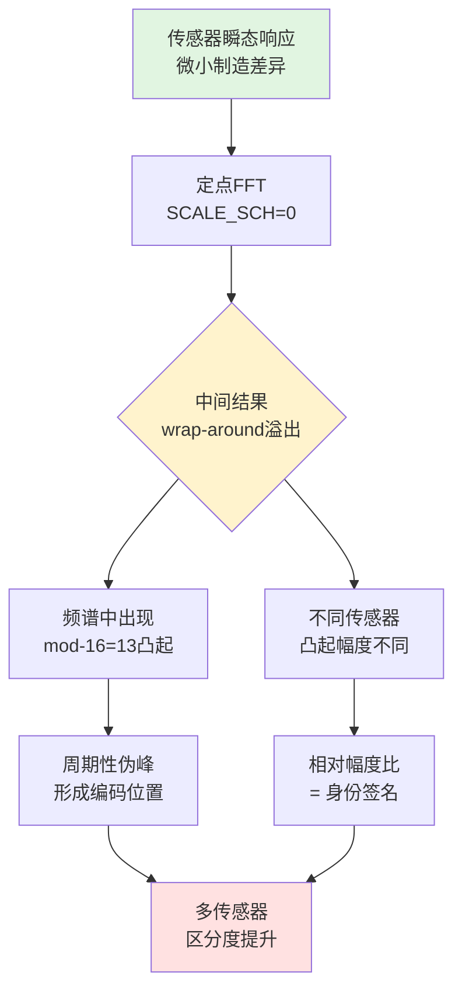

# 专利大纲：定点FFT内部溢出行为作为传感器身份特征放大器

## 拟定名称

一种利用定点频谱变换内部溢出行为放大传感器瞬态身份差异的方法、装置及系统

## 建议定位

**独立申请（方法与装置）**。这是项目的核心底层发现，解释了"为什么SCALE_SCH能产生区分度"的物理机制。与专利04（SCALE_SCH挑战扫描——怎么用）形成上下游保护，与专利01（上下电瞬态响应——做什么）形成机制-应用的组合保护。

## 要解决的技术问题

传感器上下电瞬态响应中的制造差异信号通常非常微弱，直接频谱分析难以获得足够稳定的区分度。需要一种机制，能够将微小的波形差异放大为可观测、可重复的频谱图样差异，同时保持硬件实现的低成本。

本方案要解决的问题是：如何利用定点数字信号处理器的固有非线性行为（溢出、截断、饱和），将传感器瞬态响应中原本难以区分的微小差异放大为稳定的身份特征。

## 核心发明点

1. **确定性溢出放大**：利用定点FFT在特定缩放配置（如SCALE_SCH=0，即全stage无缩放）下产生的中间结果wrap-around溢出，将传感器瞬态波形中的微小差异映射为频谱中确定性的图样差异。
2. **mod-16周期性凸起模式**：溢出行为在频谱中产生周期为16、偏移为13的梳齿状放大（`bin = 16n + 13, n mod 4 != 3`），不同传感器在这些凸起位置的相对幅度比形成稳定签名。
3. **PC端不可复现性**：该溢出行为依赖于FPGA定点硬件的精确实现，PC端浮点FFT、手写定点模型甚至Xilinx官方C model均无法完全复现，形成硬件绑定的安全边界。
4. **可控非线性观测器**：通过配置SCALE_SCH参数，有选择地控制哪些FFT stage发生溢出，从而将同一瞬态响应投影到不同的非线性特征子空间。

## 技术方案流程



### 溢出放大机制详解

```
传感器A瞬态 ──► 定点FFT ──► 频谱（bin 109凸起幅度 = 2.9x基线）
传感器B瞬态 ──► 定点FFT ──► 频谱（bin 109凸起幅度 = 2.0x基线）
传感器C瞬态 ──► 定点FFT ──► 频谱（bin 109无显著凸起）
         ↑
    SCALE_SCH=0（全stage无缩放）
    → 中间结果累加时发生wrap-around
    → 特定bin位置出现确定性放大
```

### mod-16凸起模式

```
Bin index:  13   29   45   61   77   93  109  125  ...
            ↑    ↑    ↑         ↑    ↑    ↑
         有凸起  有   有   无   有   有   有   ...
            (n mod 4 != 3 时凸起，周期=16)

不同传感器在相同凸起位置的幅度比是稳定的
```

## 系统组成

- **定点频谱变换单元**：采用定点FFT IP，配置有可控缩放调度参数；
- **溢出观测配置单元**：用于选择产生溢出的缩放配置参数（如SCALE_SCH=0）；
- **频谱分析单元**：用于检测和量化溢出产生的频谱图样差异；
- **身份特征生成单元**：用于基于溢出放大后的频谱差异生成传感器身份模板或认证响应。

## 独立权利要求骨架

### 方法权利要求

一种基于定点频谱变换内部溢出行为的传感器身份特征放大方法，包括：

1. 获取传感器在受控电源瞬态过程中的模拟响应信号；
2. 将所述模拟响应信号输入定点频谱变换器，所述定点频谱变换器配置有使中间结果发生溢出的缩放参数；
3. 获取所述定点频谱变换器输出的频域响应，其中所述频域响应包含由所述溢出产生的确定性频谱图样；
4. 提取所述确定性频谱图样中的身份特征；
5. 基于所述身份特征生成传感器身份模板或认证响应。

### 装置权利要求

一种传感器身份特征放大装置，包括：定点频谱变换器，其配置有可控缩放参数，用于在特定缩放配置下产生中间结果溢出；频谱分析器，用于检测和量化所述溢出产生的频谱图样差异；身份特征生成器，用于基于所述频谱图样差异生成传感器身份特征。

## 从属权利要求方向

- 所述缩放参数使定点频谱变换器的全部或部分蝶形运算阶段不发生缩放，从而引发中间结果累加溢出。
- 所述确定性频谱图样包含周期性频谱伪峰，所述周期性频谱伪峰的位置与定点频谱变换器的蝶形运算结构相关。
- 所述身份特征包括所述周期性频谱伪峰的相对幅度比。
- 所述定点频谱变换器为定点快速傅里叶变换器，所述缩放参数为SCALE_SCH参数。
- 所述定点频谱变换器的溢出行为在通用浮点处理器上不可精确复现。
- 所述方法还包括：配置多组不同的缩放参数，获取多组频域响应，构建多维身份响应图谱。

## 可用实验支撑

- doc/FPGA_FFT_mod16_凸起假设.md — 完整的mod-16凸起现象记录（周期=16，offset=13）。
- doc/FFT_PC_vs_FPGA_说明.md — 10种PC模拟方法全部失败（numpy FFT、手写radix-2、Xilinx C model等）。
- doc/plans/CRP_SCALE_SCH_挑战响应方案.md — 10传感器Top3 ON峰100%落在mod-16=13的bin上，放大倍数2.0-2.9x。
- scripts/analyze_front_bin_experiment.py — OFF前4bin 99.8%区分度。
- rtl/fft_256.v — SCALE_SCH配置逻辑：`{4'b0, scale_counter[7:6], scale_counter[5:4], scale_counter[3:2], scale_counter[1:0]}`。

## 需要补的实验

- [ ] 同一传感器在固定SCALE_SCH下重复N=100次，测量mod-16凸起位置的变异系数（证明稳定性）。
- [ ] 不同传感器在相同SCALE_SCH下的凸起幅度分布对比（证明区分性）。
- [ ] 换用保守SCALE_SCH（无溢出）后区分度是否下降（证明溢出是区分度的必要条件）。
- [ ] 温度/压力漂移下溢出模式的稳定性。
- [ ] 系统性地用Xilinx C model跑全部256个SCALE_SCH配置，记录与FPGA硬件输出的corr分布。

## 附图建议

1. **溢出机制示意图**：定点FFT蝶形运算→中间结果累加→wrap-around→频谱凸起。
2. **mod-16凸起模式图**：10传感器在bin 13/29/45/61/...处的幅度对比。
3. **PC vs FPGA对比图**：同一数据在PC浮点FFT和FPGA定点FFT下的频谱差异。
4. **传感器区分度图**：有溢出放大 vs 无溢出放大的LDA投影对比。

## 风险与规避

- **关键风险**：Xilinx官方文档PG109已公开overflow产生periodic spurs的现象。
- **规避策略**：权利要求不主张"溢出行为本身"的新颖性，而主张"将定点溢出行为用于传感器瞬态身份特征增强的系统化方法"。说明书中明确区分：现有技术仅指出overflow是artifact需避免，本发明主动利用该artifact作为身份特征放大器。
- **术语注意**："定点非线性观测器"在控制理论中有现有含义，需在说明书中重新定义：本发明中的"非线性观测器"特指"将定点DSP的非线性artifacts（溢出、截断、饱和）作为可控观测机制，用于增强物理信号中的微小差异"。
