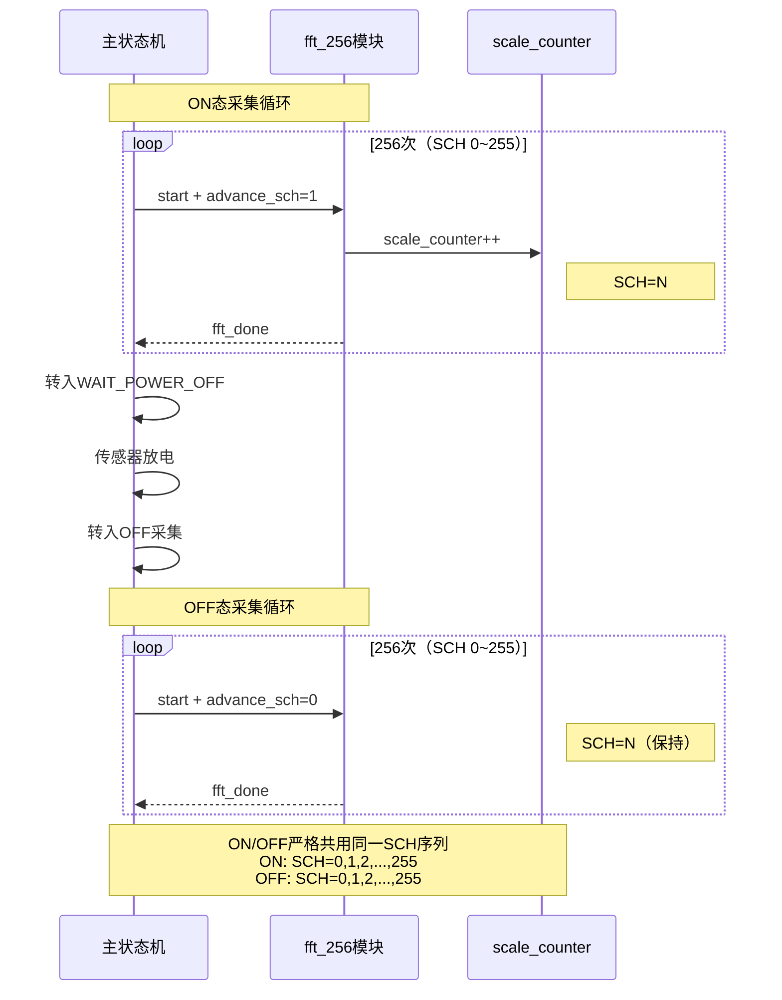
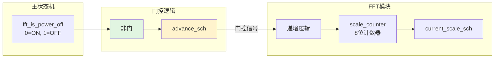

# 专利大纲：ON/OFF双态挑战码同步绑定机制

## 拟定名称

一种传感器上下电双态身份认证中的挑战码同步绑定方法及装置

## 建议定位

**独立申请或专利04的强从属权利要求**。V5.6引入的硬件机制，具体实现了"ON/OFF共用同一挑战码字"的概念。专利04的权利要求中提到了该概念，但未披露硬件实现细节。本专利保护具体的电路级实现机制。

## 要解决的技术问题

在传感器上下电双态身份认证中，如果上电响应和下电响应使用不同的挑战参数（如不同的SCALE_SCH值），则两个响应位于不同的特征空间，无法直接联合判决。即使强制联合，也会因特征空间错位导致认证性能下降。同时，挑战参数空间的搜索维度会从256扩展到256×256=65536，大幅增加注册和验证复杂度。

本方案要解决的问题是：如何在硬件层面确保上电响应和下电响应严格对应同一挑战参数，使双态特征可直接联合判决。

## 核心发明点

1. **advance_sch门控机制**：通过一个布尔信号`advance_sch`控制SCALE_SCH计数器的递增行为——上电采集时`advance_sch=1`（计数器递增，切换到下一个挑战码），下电采集时`advance_sch=0`（计数器保持，复用同一挑战码）。
2. **单计数器双态复用**：仅用一个8位计数器即可实现ON/OFF双态共用256个挑战码，无需额外存储或同步逻辑。
3. **时序严格对齐**：ON FFT完成后的`fft_done`信号触发OFF采集，确保同一挑战码的ON响应和OFF响应在时间上连续采集，消除环境漂移导致的挑战码错位。

## 技术方案流程



## 硬件实现



### 关键RTL代码逻辑

```verilog
// 主状态机中：ON态设置fft_is_power_off=0，OFF态设置fft_is_power_off=1
assign fft_advance_sch = !fft_is_power_off;

// fft_256.v中：仅在advance_sch=1时递增计数器
if (advance_sch) begin
    if (scale_counter == 8'd255)
        scale_counter <= 8'd0;
    else
        scale_counter <= scale_counter + 8'd1;
end
```

## 系统组成

- **状态标记单元**：用于标记当前处于上电采集状态还是下电采集状态；
- **挑战码计数器**：用于产生顺序变化的挑战码序列；
- **门控单元**：用于根据所述状态标记控制挑战码计数器是否递增；
- **频谱变换单元**：用于在每个挑战码下对传感器瞬态响应进行定点频谱变换。

## 独立权利要求骨架

### 方法权利要求

一种传感器上下电双态身份认证中的挑战码同步绑定方法，包括：

1. 在传感器上电采集阶段，依次使用一组挑战码对传感器的上电瞬态响应进行频谱变换，每完成一次变换后递增挑战码；
2. 在传感器下电采集阶段，使用与所述上电采集阶段相同顺序的相同挑战码对传感器的下电瞬态响应进行频谱变换，每完成一次变换后保持挑战码不变；
3. 获取与每个挑战码对应的上电频域响应和下电频域响应；
4. 将所述上电频域响应和所述下电频域响应作为一对联合特征用于身份认证。

### 装置权利要求

一种传感器上下电双态身份认证中的挑战码同步绑定装置，包括：挑战码计数器，用于产生挑战码序列；状态标记寄存器，用于标记当前处于上电采集状态还是下电采集状态；门控逻辑，用于在所述状态标记为上电采集时允许所述挑战码计数器递增，在所述状态标记为下电采集时禁止所述挑战码计数器递增。

## 从属权利要求方向

- 所述上电采集阶段和下电采集阶段在同一个自动循环周期内连续执行。
- 所述上电采集阶段完成后，系统等待预定放电时间再进入下电采集阶段。
- 所述挑战码为定点频谱变换器的缩放调度参数SCALE_SCH。
- 所述门控逻辑由单个非门实现：`advance_sch = !is_power_off`。
- 所述装置还包括上电频域响应缓存和下电频域响应缓存，分别存储对应同一挑战码的双态响应。
- 所述身份认证还包括：将所述上电频域响应和所述下电频域响应拼接为联合特征向量，与注册模板进行匹配。

## 可用实验支撑

- V5.6固件已实现advance_sch gating，ON/OFF共用同一code word。
- rtl/transient_puf_test_top.v line 548-549：`assign fft_advance_sch = !fft_is_power_off`。
- rtl/fft_256.v line 146-151：门控递增逻辑。
- 10传感器基线数据证明ON/OFF双态数据在挑战维度严格对齐。

## 需要补的实验

- 不同advance策略（共码vs分码）的认证性能对比：共码时ON+OFF联合特征的区分度 vs 分码时的区分度。
- ON/OFF共用challenge与不同challenge的注册/验证分离实验。
- 挑战码错位（如ON用SCH=N而OFF用SCH=N+1）对联合特征匹配的影响。

## 附图建议

1. **时序图**：ON采集→OFF采集的完整时序，标注advance_sch信号状态。
2. **门控逻辑电路图**：非门→advance_sch→计数器递增使能。
3. **特征空间对比图**：共码时ON/OFF特征对在二维空间中的分布 vs 分码时的错位分布。
4. **系统状态转移图**：ON态14状态→WAIT_POWER_OFF→OFF态14状态的完整流程。

## 风险与规避

- V5.6引入的硬件机制，未见现有技术公开。
- 风险较低，但需证明"共码"相比"分码"有实质性的技术优势（如联合特征区分度提升、模板存储减少50%）。
- 权利要求应覆盖"门控逻辑"的抽象概念，不限定于"非门"的具体实现。
