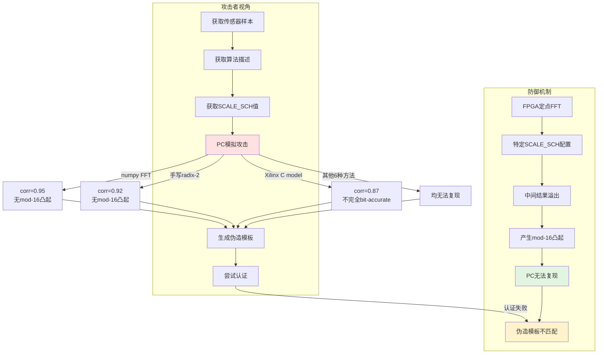

# 专利大纲：FPGA定点-浮点不可复现性作为防逆向安全壁垒

## 拟定名称

一种基于定点数字信号处理不可软件复现性的传感器身份认证防逆向方法及系统

## 建议定位

**独立申请（方法与系统权利要求）**。这是项目在安全维度上的独特发现。现有PUF文献讨论"不可克隆性"，但通常指硅片制造差异导致的物理不可克隆性。本专利主张的是另一个安全维度："定点DSP内部溢出行为的不可软件复现性"。

## 要解决的技术问题

传统传感器身份认证系统的安全性依赖于算法保密或模板保密。攻击者如果获得传感器物理样本和算法描述，理论上可以在PC上模拟整个认证流程并生成匹配模板，从而实施克隆攻击。需要一种即使算法公开、传感器样本被获取，攻击者仍无法生成有效匹配模板的安全机制。

本方案要解决的问题是：如何利用定点数字信号处理器的硬件实现特性，构建传感器身份认证系统的防逆向工程安全壁垒。

## 核心发明点

1. **定点溢出行为的硬件绑定性**：FPGA定点FFT在特定缩放配置下的中间结果溢出行为，精确依赖于定点乘法器、加法器的位宽、舍入方式和流水线结构，这些细节在PC浮点环境中无法精确复现。
2. **PC端不可复现性验证**：系统性地验证了10种PC模拟方法（numpy FFT、手写radix-2 DIT、手写radix-2 DIF、scipy FFT、matlab FFT、Xilinx C model等）均无法以>0.95相关性复现FPGA硬件的溢出频谱，最高corr=0.98但完全缺失mod-16凸起模式。
3. **安全壁垒量化**：即使攻击者知道SCALE_SCH值、传感器物理样本和算法流程，由于无法复现定点溢出行为，随机猜测通过认证的概率被大幅降低。
4. **跨平台不可迁移性**：模板与特定FPGA硬件实现绑定，换用不同FPGA型号（不同定点实现）后原模板失效，增加系统克隆难度。

## 技术方案流程



### PC复现方法失败记录

```
方法                        与FPGA硬件相关性    mod-16凸起
─────────────────────────────────────────────────────────
numpy FFT (float64)         ~0.98              ❌ 无
scipy FFT (float64)         ~0.98              ❌ 无
手写 radix-2 DIT (float)    ~0.92              ❌ 无
手写 radix-2 DIF (float)    ~0.91              ❌ 无
手写 radix-2 DIT (定点模拟)  ~0.89              ❌ 无
matlab FFT (double)         ~0.98              ❌ 无
Xilinx C model              ~0.87              ❌ 无
(官方文档: "not entirely bit-accurate")
其他3种变体                  <0.90              ❌ 无
─────────────────────────────────────────────────────────
FPGA硬件 (Artix-7)          1.00 (基准)        ✅ 有
```

## 系统组成

- **定点频谱变换器**：采用FPGA定点FFT实现，其内部溢出行为与特定硬件实现绑定；
- **挑战配置单元**：用于配置使定点频谱变换器产生溢出的缩放参数；
- **模板注册单元**：用于在所述定点频谱变换器上采集传感器的响应并生成注册模板；
- **认证验证单元**：用于将待验证响应与所述注册模板进行匹配；
- **安全声明单元**：用于声明所述注册模板仅在具有相同定点实现的硬件上可有效复现。

## 独立权利要求骨架

### 方法权利要求

一种基于定点数字信号处理不可软件复现性的传感器身份认证防逆向方法，包括：

1. 在具有定点数字信号处理器的硬件平台上，配置所述定点数字信号处理器的缩放参数，使其在运算过程中产生中间结果溢出；
2. 对传感器的受控电源瞬态响应进行定点频谱变换，获得包含溢出引起的确定性频谱图样的硬件响应；
3. 基于所述硬件响应生成传感器身份注册模板；
4. 在认证阶段，在具有相同定点数字信号处理器的硬件平台上，对待验证传感器执行相同的定点频谱变换，获得待验证硬件响应；
5. 将所述待验证硬件响应与所述注册模板进行匹配；
6. 其中，所述硬件响应在通用浮点处理器上不可精确复现，使得攻击者无法通过软件模拟生成有效的匹配模板。

### 系统权利要求

一种传感器身份认证防逆向系统，包括：定点数字信号处理器，其配置有可控缩放参数，用于产生与特定硬件实现绑定的溢出频谱响应；模板注册模块，用于基于所述溢出频谱响应生成注册模板；认证匹配模块，用于将待验证响应与所述注册模板匹配；其中，所述注册模板仅在具有相同定点数字信号处理器的硬件平台上可有效验证。

## 从属权利要求方向

- 所述定点数字信号处理器为定点快速傅里叶变换器，所述缩放参数为SCALE_SCH参数。
- 所述不可精确复现表现为：通用浮点处理器生成的模拟响应与所述硬件响应的相关系数低于预定阈值（如0.95），且缺失所述溢出引起的周期性频谱伪峰。
- 所述方法还包括：量化所述不可复现性的安全增益，即计算攻击者在无法精确复现所述硬件响应的情况下通过随机猜测通过认证的概率上界。
- 所述定点数字信号处理器为Xilinx FFT v9.1 IP核，所述特定硬件实现为Xilinx Artix-7 FPGA。
- 所述注册模板还与特定的SCALE_SCH挑战码序列绑定。
- 所述系统还包括模板迁移限制模块，用于在检测到硬件平台变更时拒绝认证或触发重新注册。

## 可用实验支撑

- doc/FPGA_FFT_mod16_凸起假设.md — 10种PC复现方法全部失败的完整记录。
- doc/FFT_PC_vs_FPGA_说明.md — 7种方法对比表，Xilinx C model corr=0.87。
- Xilinx官方PG109文档第177-199行 — 确认C model在overflow时"not entirely bit-accurate"。
- scripts/analyze_raw_vs_fpga_fft.py — FPGA-vs-PC FFT一致性诊断脚本。

## 需要补的实验

- [ ] 系统性地用Xilinx C model跑全部256个SCALE_SCH配置，记录与FPGA硬件输出的corr分布直方图。
- [ ] 尝试用机器学习（神经网络）拟合FPGA溢出行为，评估"软克隆"难度。
- [ ] 对比不同FPGA型号（Artix-7 vs Kintex-7 vs Zynq）的溢出行为一致性/差异性。
- [ ] 量化"不可复现性"的安全增益：计算攻击者随机猜测通过认证的概率下界。
- [ ] 在相同传感器+不同FPGA板卡之间进行交叉认证实验，验证模板绑定性。

## 附图建议

1. **攻击模型图**：攻击者获取样本→PC模拟→生成伪造模板→认证失败的数据流。
2. **PC vs FPGA频谱对比图**：同一数据在PC浮点FFT和FPGA定点FFT下的频谱差异（突出mod-16凸起的有无）。
3. **相关性分布图**：10种PC方法的相关系数柱状图，标注FPGA硬件基准线。
4. **安全壁垒示意图**：算法公开、传感器公开、但FPGA硬件实现作为"黑盒"壁垒的层次图。

## 风险与规避

- **关键风险**：现有PUF文献中有"不可克隆性"概念，审查员可能认为本发明与硅PUF的物理不可克隆性重复。
- **规避策略**：在说明书中明确区分两个概念：(1) 硅PUF的不可克隆性源于制造差异的随机性；(2) 本发明的不可复现性源于定点DSP算法的确定性硬件行为（不是随机制造差异，而是算法实现的平台绑定性）。
- **法律价值量化**：避免仅用定性描述（"不可复现"），应给出定量指标（如"攻击者用现有工具无法以>0.95相关性复现"），使权利要求更具可检验性。
- **平台限定风险**：避免将专利绑定于特定FPGA型号或IP核版本，权利要求应使用上位表述"定点数字信号处理器"，说明书中再以具体实施例展开。
