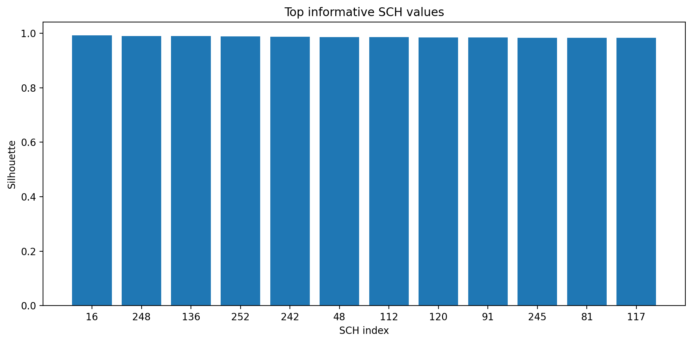
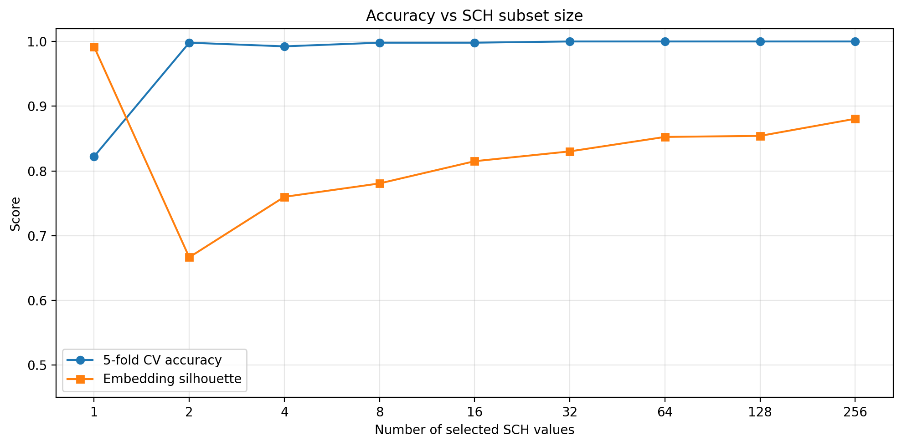
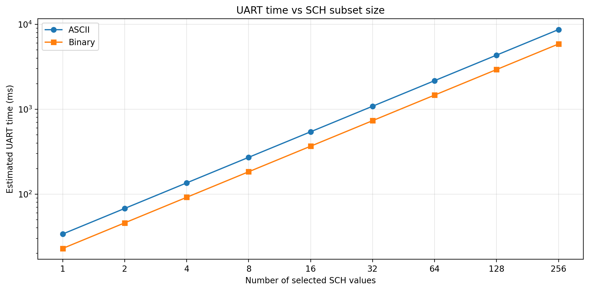
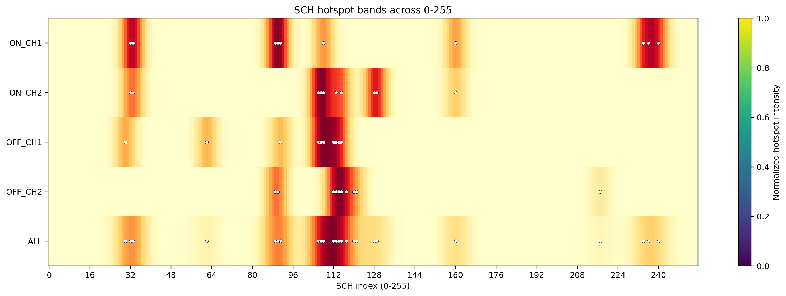

# SCH 子集与 UART 开销量化评估

## 结论

这次评估回答两个问题：
1. `sch` 从 `0..255` 全扫是否必要；
2. 只保留少量高价值 `sch` 时，UART 能省多少，识别会掉多少。

结论很明确：研究阶段需要全扫来找出高价值区间，但在线识别阶段不需要全扫。保留少量高价值 `sch`，识别率几乎不掉，UART 开销却能明显下降。

## 关键结果

- `top 8 sch` 的 5-fold CV 准确率：`0.9981`
- `top 16 sch` 的 5-fold CV 准确率：`0.9981`
- `top 256 sch` 的 5-fold CV 准确率：`1.0000`
- `top 8 sch` 相比 `256 sch` 的 ASCII 传输时间缩短：`32.0x`

也就是说，前 8 个最有信息量的 `sch` 已经保住了大部分识别能力。

## 最推荐子集

前 8 个 `sch`：

`[16, 248, 136, 252, 242, 48, 112, 120]`

前 16 个 `sch`：

`[16, 248, 136, 252, 242, 48, 112, 120, 91, 245, 81, 117, 218, 115, 86, 122]`

## 图示

## 结果解释

第一张图说明：单个 `sch` 的区分能力差异很大，不是所有 `sch` 都有同样的身份信息量。

第二张图说明：随着 `sch` 数量增加，识别率很快饱和，`8` 个左右已经接近上限，后面继续加到 `16/32/64/128/256`，收益很小。

第三张图说明：UART 时间几乎线性随 `sch` 数量增长，所以减少 `sch` 数量是最直接、最有效的降时延手段。

第四张图是更直观的热区图。它显示高价值 `sch` 不是离散乱点，而是明显成带分布，说明身份信息更可能集中在若干连续区间，而不是均匀铺在 `0..255` 全部位置。

## 对你的问题的直接回答

### UART 怎么优化

- 优先减少在线发送的 `sch` 个数
- 再考虑 ASCII 改 binary
- 再考虑只传筛选后的频谱特征，而不是 RAW 全量数据

### `sch 0..255` 全扫有没有必要

- 研究阶段：有必要，用来找出真正有区分力的 `sch` 区间
- 部署阶段：没必要，保留 `top 8` 或 `top 16` 更划算

### CH1 和 CH2 是否等价

当前数据里不等价。`OFF_CH2` 明显强于 `OFF_CH1`，`ON_CH2` 也整体优于 `ON_CH1`，所以不建议默认平均对待两路通道。

### 这些 `sch` 的位置有没有规律

有，而且是“成带区间”规律，不是随机散点。当前最明显的热区包括：

- `ON_CH1`: `32~33`, `89~91`, `106~108`, `234~240`
- `ON_CH2`: `32~33`, `106~109`, `113~115`, `128~129`, `235~236`
- `OFF_CH1`: `106~108`, `112~116`, `120~122`
- `OFF_CH2`: `89~90`, `112~115`, `120~121`, `241~243`

这说明后续在线配置时，不建议随机挑 `sch`，而应该优先保留这些成带的高价值区间。

## 四路视角摘要

- `ON_CH1` top10: `[33, 240, 90, 108, 160, 234, 236, 32, 89, 91]`
- `ON_CH2` top10: `[107, 129, 115, 128, 106, 33, 160, 32, 113, 108]`
- `OFF_CH1` top10: `[30, 62, 91, 106, 107, 108, 112, 113, 114, 115]`
- `OFF_CH2` top10: `[89, 90, 112, 113, 114, 115, 117, 120, 121, 217]`

## 复现

评估脚本：

- `evaluate_sch_subset_tradeoff.py`

出图和报告脚本：

- `render_report.py`
