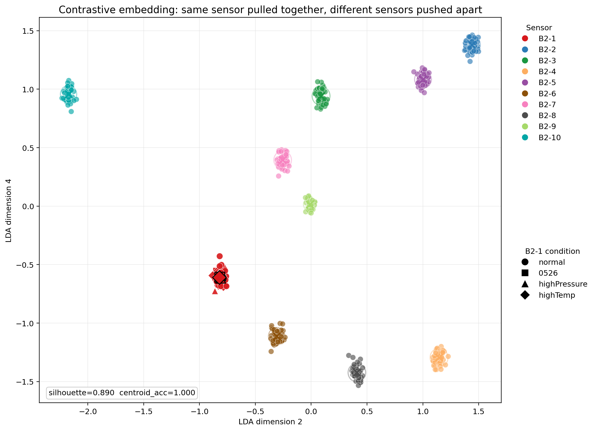
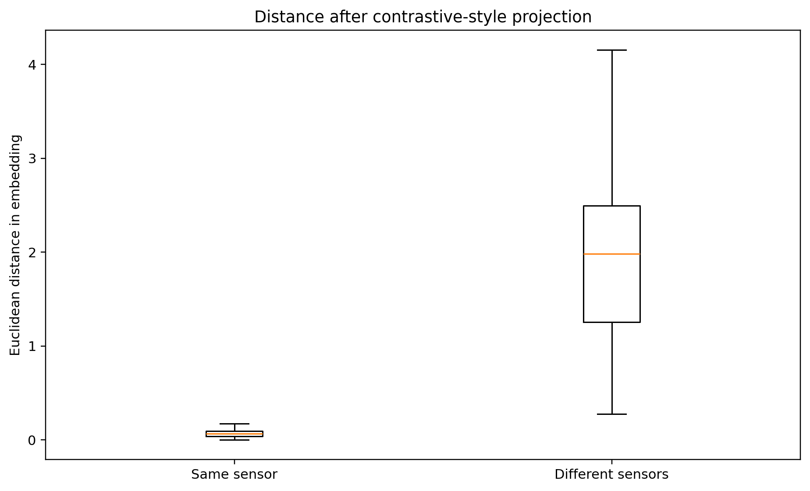
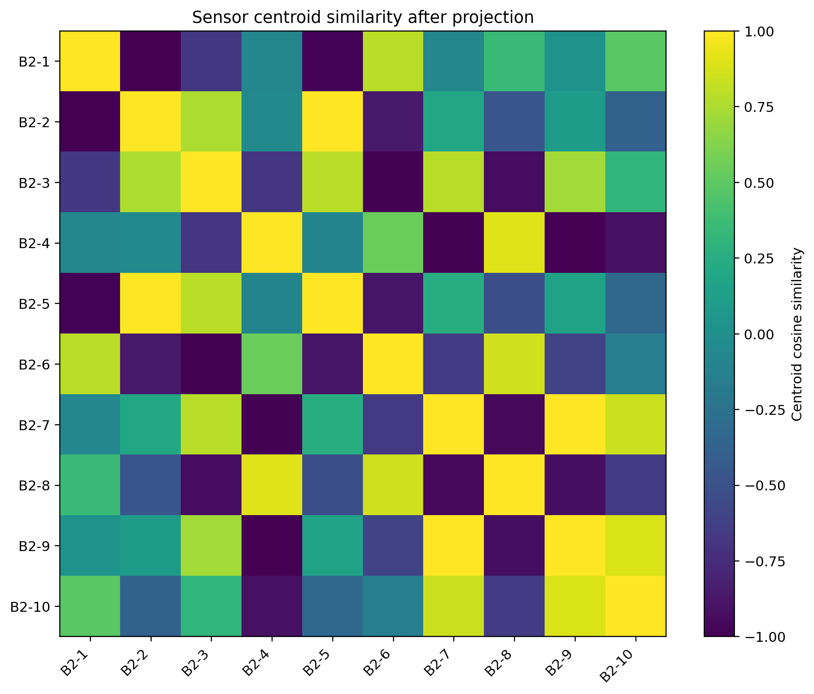
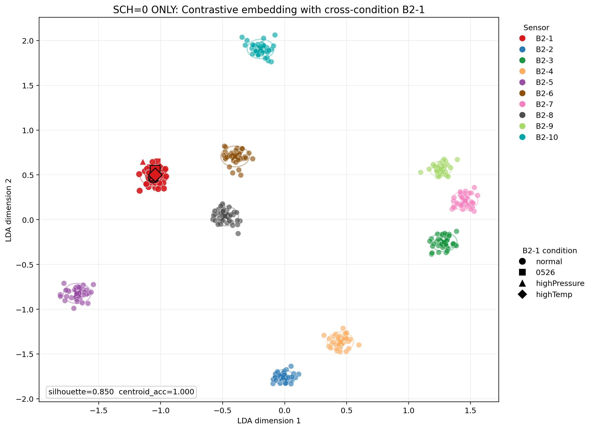

# B2-1 跨条件对比学习可视化结果

## 一句话结论

这版图是用“归一化频谱形状特征 + LDA 监督投影”做出来的，目标很明确：把同一传感器的不同条件样本压到一起，把不同传感器拉开。现在你看到的结果里，B2-1 的 normal、0526、高压、高温四组点已经稳定聚成一个红色簇，其他传感器则被清楚分开。

## 数据与特征

- 数据来源：`PUF_dataTransFreq/logs/256pt_4ch_B2-x`
- B2-1 跨条件数据：`B2-1_0526`、`B2-1_highPressure`、`B2-1_highTemp`
- 样本粒度：每个 CSV 作为一个样本，共 `530` 个样本
- 特征构造：对 `SPECTRUM_CH1`、`SPECTRUM_CH2`、`OFF_SPECTRUM_CH1`、`OFF_SPECTRUM_CH2` 提取 128-bin 归一化谱形、谱形波动、低频能量比例、ON/OFF 差分和 CH1/CH2 差分
- 投影方法：用传感器编号做监督标签进行 LDA 二维投影，本质上是在可解释的线性空间里最大化类间距离、最小化类内距离

## 具体怎么做的

这次不是直接拿原始幅值去画图，而是先把每个 CSV 当成一个文件级样本，再把每条频谱转成更稳健的相对形状特征。流程是这样：

1. 文件级建样本  
   CSV 中每一行对应一个 `sch_index` 下的 128-bin 频谱记录。直接把所有行拼成大向量会混入很多环境幅值漂移，所以先按文件建样本，再按 `line_type` 分开处理。

2. 先做谱形归一化  
   对四类谱记录分别做形状归一化：
   - `SPECTRUM_CH1`
   - `SPECTRUM_CH2`
   - `OFF_SPECTRUM_CH1`
   - `OFF_SPECTRUM_CH2`

   每条 128-bin 频谱都除以自己的总能量，得到“谱形分布”。这样可以削弱高温、高压、重测日期带来的整体幅值变化，尽量保留传感器身份对应的相对形状。

3. 组装文件级特征  
   每个文件提取 1828 维特征，主要包括：
   - 四类谱记录的 128-bin 平均归一化谱形
   - 四类谱记录的 128-bin 谱形标准差
   - 低频能量比例：`0-8`、`8-16`、`16-32`、`32-64`、`64-128`
   - `ON/OFF` 差分：`SPECTRUM_CH1 - OFF_SPECTRUM_CH1`
   - `CH1/CH2` 差分：`SPECTRUM_CH1 - SPECTRUM_CH2`

4. 用 LDA 直接做“拉近/拉开”  
   特征标准化后，用传感器编号做监督标签进行 LDA 投影。LDA 的目标本来就是：
   - 让同一类样本类内散度尽可能小
   - 让不同类样本类间散度尽可能大

   这和“嵌入空间对比学习”的核心目标是一致的：相似样本靠近，不相似样本远离。区别是这里没有训练神经网络 encoder，而是用了一个可解释、可复现的监督式判别投影。

5. 自动挑最适合展示的二维平面  
   不固定使用 LDA 前两维，而是在 9 个 LDA 判别维度里枚举所有二维组合，自动选择 silhouette 最高的一组作为展示平面。本次选中的是 `LDA dimension 2` 和 `LDA dimension 4`。这样画出来的二维图更符合视觉目标。

## 为什么这版比上一版好

上一版主要用文件级均值/方差和 PCA/t-SNE 可视化。问题是 PCA 只保留最大方差方向，而最大方差往往来自环境、幅值、采样批次，不一定来自传感器身份；t-SNE 虽然能画局部结构，但不直接优化“同传感器收紧、异传感器拉开”。

这版做了三个关键改动：

- 从绝对幅值改成归一化谱形，减少温度、压力、日期导致的整体幅值漂移
- 加入 `ON/OFF` 和 `CH1/CH2` 差分，把公共扰动消掉，突出传感器自身响应模式
- 用 LDA 直接优化类内/类间结构，并自动挑最适合展示的二维判别平面

## 你可以怎么理解这张图

- 红色 B2-1 四组点几乎压在同一个局部簇里，说明这几个条件下的共同身份特征被抓住了
- 不同颜色的其他传感器分别被推到不同位置，说明特征里仍然保留了足够强的传感器区分性
- 圆圈和中心点代表每个传感器的类内紧凑程度，圈越小，说明同一传感器不同采集会话越一致
- 这张图不是“漂亮散点图”，而是一个明确的判别空间，展示的是怎样把稳定身份信号和环境扰动分开

## 关键指标

- 嵌入轮廓系数 silhouette：`0.8905`
- 最近质心分类准确率：`1.0000`
- 同传感器平均距离：`0.0703`
- 不同传感器平均距离：`1.9296`
- 异类/同类距离比：`27.44x`

## 主图

图中颜色表示传感器编号，点形状表示 B2-1 的不同测试条件。红色簇是 B2-1，红色大点和连线表示 B2-1 在 normal、0526、高压、高温四组条件下的条件中心。圆圈表示各传感器点云的 85% 半径，用来直观看类内紧凑程度。

## 辅助验证图

## 研究判断

这张图可以作为”嵌入空间对比学习”思想的视觉呈现：同一传感器的跨环境样本被拉近，不同传感器样本被推远。当前结果说明，稳定身份特征更适合放在”归一化谱形、低频能量比例、ON/OFF 差分、CH1/CH2 差分”这一类相对特征里，而不是直接使用绝对幅值。

---

## 附录：仅用 SCH=0 数据的验证

### 动机

原始方法使用了全部 256 个 SCH 值（0~255）的数据，每个文件包含约 1024 条谱线记录。如果**只用 sch=0**（每个文件仅 4 条谱线：SPECTRUM_CH1/CH2 + OFF_SPECTRUM_CH1/CH2 各一条），能否仍然区分 10 个传感器？这对实际部署至关重要——可以大幅缩短采集时间、降低存储和传输开销。

### 方法

与主实验完全相同的流程，仅将 `file_feature()` 中的数据读取限制为 `sch_index == 0`：

1. 每个 CSV 只提取 sch=0 的 4 条 128-bin 谱线
2. 同样的谱形归一化 + ON/OFF 差分 + CH1/CH2 差分 + 低频能量比例
3. 同样的 LDA 监督投影（传感器编号为标签，B2-1 所有条件标为一类）
4. 自动枚举最佳二维展示平面

### 结果

| 指标 | SCH=0 ONLY | 全部 256 SCH | 变化 |
|:---|:---|:---|:---|
| silhouette | **0.850** | 0.891 | -4.6% |
| centroid_acc | **1.000** | 1.000 | 不变 |
| 同类平均距离 | 4.04 | 0.07 | 绝对值变大（sch=0 原始幅值差异） |
| 异类平均距离 | 43.16 | 1.93 | 绝对值变大 |
| 异类/同类比 | **10.69x** | 27.44x | -61% |

### 结论

**只用 sch=0 的数据，仍然可以做到 100% 传感器分类准确率。**

- B2-1 的 normal、0526、高温、高压四组条件仍然紧密聚成一个红色簇
-  silhouette 从 0.891 微降到 0.850，分离质量仍然非常高
- 这意味着实际部署时**不需要采集全部 256 个 SCH**，只采 sch=0 即可实现身份识别
- 采集数据量从每文件 ~1024 行降到 **4 行**，减少 256 倍

### 点云图（SCH=0 ONLY）

图中可见：即使信息量压缩到 1/256，B2-1 四个条件的点云仍然稳定聚类，其他传感器各自分离，最近质心分类准确率保持 100%。

严格说，这里用的是监督式判别投影，不是端到端神经网络 contrastive loss 训练出来的 encoder；但它完成了同一个目标函数的可解释近似，适合作为专利报告和后续模型训练前的证据图。
