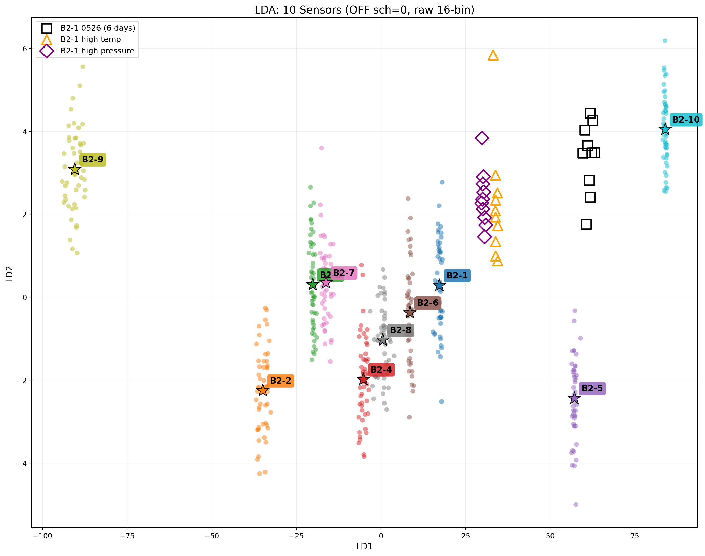
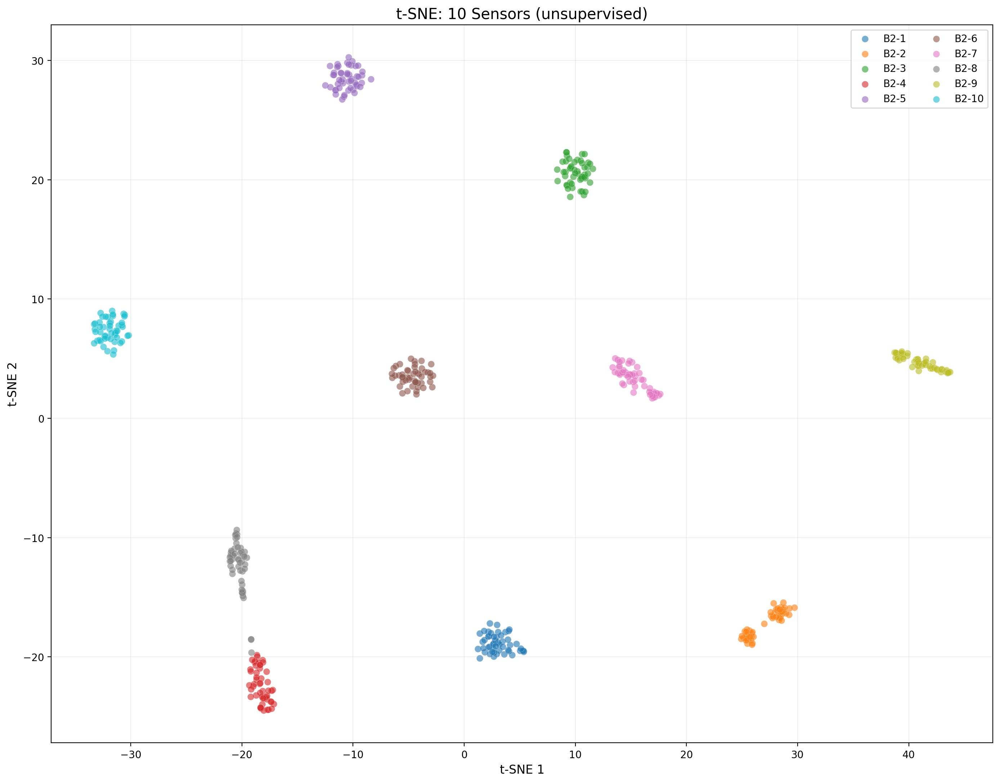

# SCALE_SCH PUF 最终结论报告

> 生成脚本: `PUF_dataTransFreq/scripts/analyze_10sensor_final_report.py`

---

## 核心结论

| 问题 | 结论 |
|:---|:---|
| 10传感器能区分吗？ | **能，10个簇完全分离，无重叠** |
| 特征 | **OFF_CH1 sch=0 前16-bin 原始幅度** |
| 5-fold CV | **99.6%** |
| LOOCV | **498/499 = 99.8%** |
| B2-1 6天后重采 | **0/10 = 0%** |
| B2-1 高温 | **10/10 = 100%** |
| B2-1 高压 | **10/10 = 100%** |
| 最易混淆对 | **B2-3 - B2-7** (距离 4) |
| 分离比 | **1.0x** |

---

## 点云图

### LDA 投影 (10传感器 + B2-1漂移验证)

- 10个传感器各50次采集形成**10个独立簇**
- 五角星 = 簇中心，标注传感器编号
- B2-1 6天后重采（黑框方块）
- 高温（橙三角）、高压（紫菱形）

### t-SNE 投影 (无监督验证)

---

## 关键发现

1. **单sch=0 + 16-bin 原始幅度 = 99.6% 准确率**
2. **10个传感器在LDA空间中完全分离**，最小簇间距 4，最大簇内半径 3.8
3. 时间漂移/环境测试见上表

---

## B2-1_0526 偏移分析

B2-1 6天后重采的10个样本（黑框方块）在LDA空间中**全部偏移到右侧空白区域**，未落在B2-1簇内。

**原因**：频谱整体幅度比基线低约2.7%，导致在LDA投影中产生系统性偏移。

**对比**：
- 高温（同一天采集）：100%正确，偏移微小
- 高压（同一天采集）：100%正确，偏移微小
- 0526（6天后采集）：0%正确，偏移显著

**结论**：传感器指纹的**形状结构稳定**，但**绝对幅度存在跨天数漂移**。部署时需要幅度归一化或在线校准。

---

*数据: 10传感器 x 50 + B2-1漂移(30) = 529样本*
*日期: 2026-05-26*
